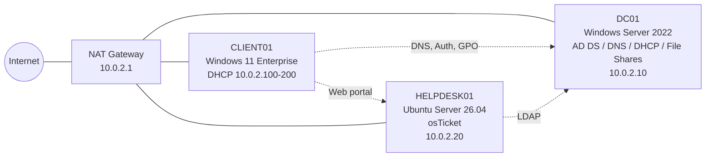
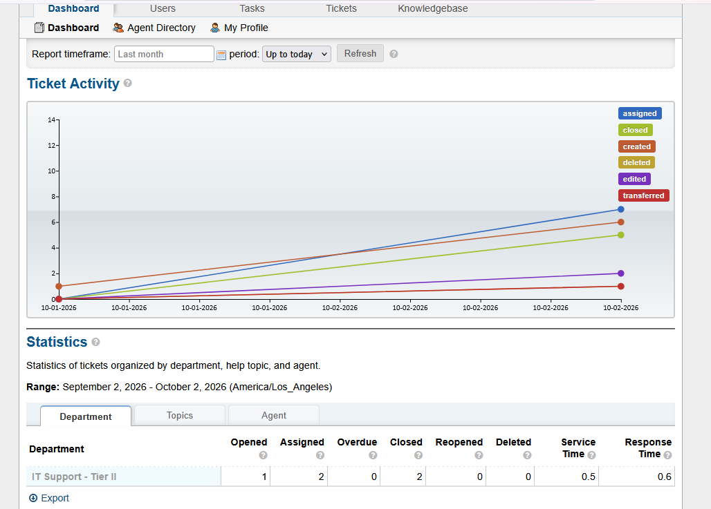

# Active Directory Help Desk Lab

A hands-on Windows Server lab built to practice real-world IT support tasks: user account management, password resets, account lockouts, onboarding/offboarding, file share permissions, and Group Policy troubleshooting. Tickets are handled end to end in **osTicket**, integrated with Active Directory for single sign-on.

**Author:** Andrii Khmelevskyi

## Skills Demonstrated

- **Active Directory Domain Services:** domain setup, OU design, users, security groups
- **DNS & DHCP:** server configuration, scopes, client name resolution
- **Group Policy:** drive mapping with item-level targeting, screen lock, Control Panel restrictions
- **File Shares:** Share vs. NTFS permissions, department-based access control
- **PowerShell:** bulk user creation, account unlock, password reset
- **Ticketing (osTicket):** tiered support, help topics, SLAs, canned responses, internal notes, escalation, AD/LDAP sign-in
- **Linux:** Ubuntu Server, Apache, MariaDB, PHP, SSH
- **Troubleshooting:** `ipconfig`, `ping`, `gpupdate`, `gpresult`, `whoami`
- **Ticket documentation:** issue → troubleshooting → resolution

## Lab Environment

| Component | Details |
|---|---|
| Hypervisor | Oracle VirtualBox |
| DC01 | Windows Server 2022 — AD DS, DNS, DHCP, File Server — `10.0.2.10` |
| CLIENT01 | Windows 11 Enterprise — domain-joined workstation — DHCP |
| HELPDESK01 | Ubuntu Server 26.04 — osTicket 1.18.4 (Apache, MariaDB, PHP 8.4) — `10.0.2.20` / `helpdesk.lab.local` |
| Domain | `lab.local` |
| Network | VirtualBox NAT Network `LabNet` — `10.0.2.0/24` |

## Network Diagram



## OU Structure

```
lab.local
├── _USERS
│   ├── HR
│   ├── IT
│   └── Sales
├── _COMPUTERS
├── _GROUPS        (HR-Staff, IT-Staff, Sales-Staff)
├── _SERVICE_ACCOUNTS   (svc_osticket)
└── _DISABLED
```

## Build Guide

1. [Domain Controller setup](setup/01-domain-controller.md)
2. [OUs, groups, and bulk users (PowerShell)](setup/02-users-and-ous.md)
3. [DHCP and joining a client to the domain](setup/03-dhcp-and-client.md)
4. [File shares and Group Policy](setup/04-shares-and-gpo.md)
5. [osTicket server installation](setup/05-osticket-install.md)
6. [osTicket configuration: tiers, SLAs, help topics](setup/06-osticket-configuration.md)
7. [osTicket + Active Directory (LDAP)](setup/07-osticket-ad-integration.md)

## Help Desk Tickets

| # | Ticket | Key Skills |
|---|---|---|
| 001 | [Password reset](tickets/001-password-reset.md) | ADUC, PowerShell |
| 002 | [Account lockout](tickets/002-account-lockout.md) | Lockout policy, `Search-ADAccount`, `Unlock-ADAccount` |
| 003 | [New hire onboarding](tickets/003-onboarding.md) | User templates, group membership |
| 004 | [Employee offboarding](tickets/004-offboarding.md) | Disable, remove access, archive |
| 005 | [Shared drive not showing](tickets/005-shared-drive-access.md) | `gpresult`, groups vs. OUs, token refresh |

### Tickets in osTicket

| # | Ticket | Channel | Key Skills |
|---|---|---|---|
| OT-1 | [Forgot password](tickets/osticket/OT-1-password-reset.md) | Web portal | Auto-routing, canned response, internal note |
| OT-2 | [Account locked](tickets/osticket/OT-2-account-locked.md) | Phone | Agent-created ticket, `Unlock-ADAccount` |
| OT-3 | [Agent cannot sign in](tickets/osticket/OT-3-agent-login.md) | Internal | LDAP root cause: `pwdLastSet = 0` + lockout |
| OT-4 | [Employee offboarding](tickets/osticket/OT-4-offboarding.md) | Email | Auto-routed to Tier II, AD offboarding |
| OT-5 | [Shared folder access](tickets/osticket/OT-5-escalation.md) | Agent-created | Tier I → Tier II transfer, least privilege |



## Scripts

- [`Create-LabUsers.ps1`](scripts/Create-LabUsers.ps1): creates the OU structure, department security groups, and 45 test users with titles and departments.

> All passwords shown in this lab are for an isolated test environment only.
