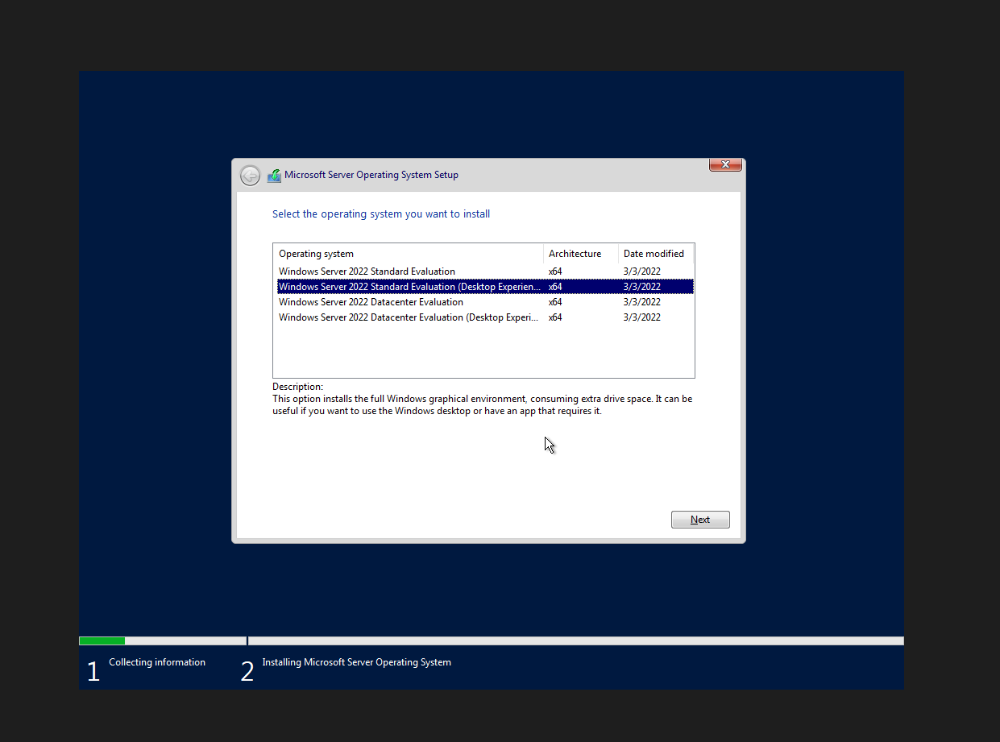
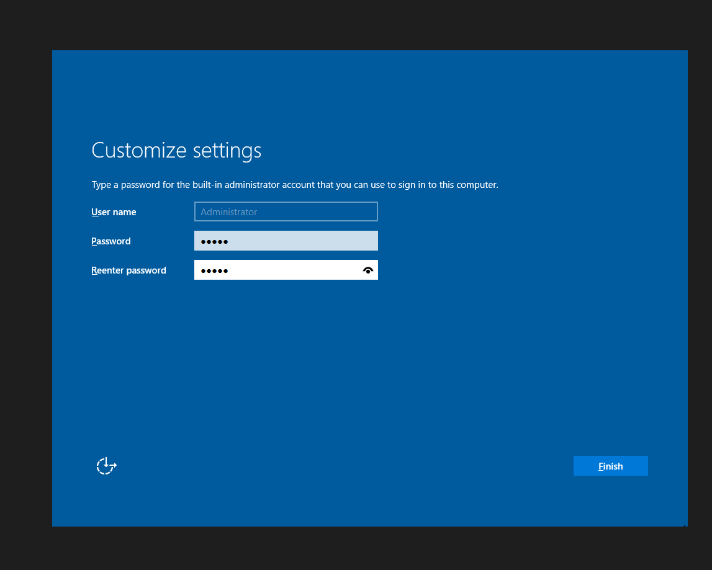
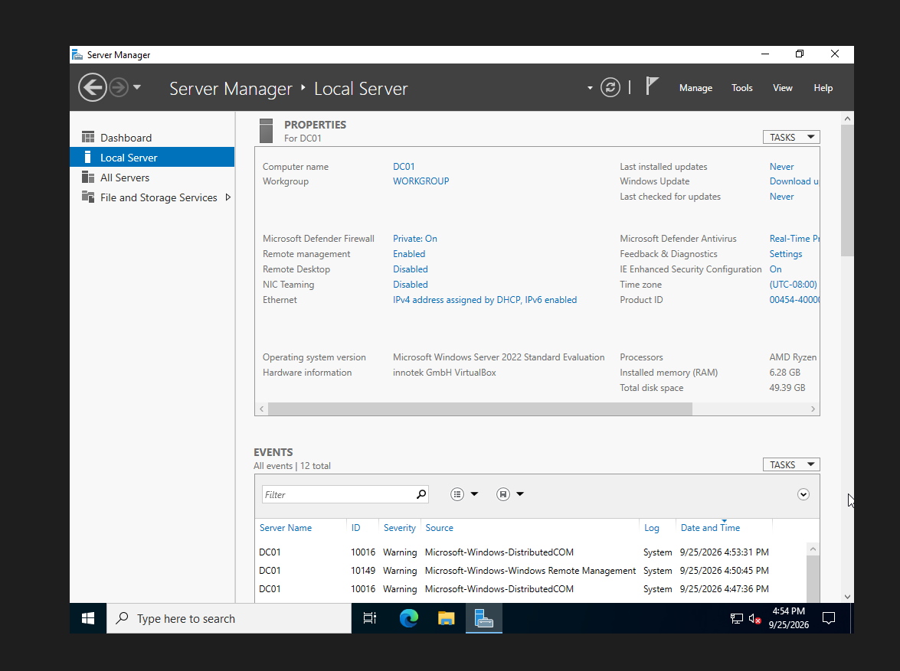
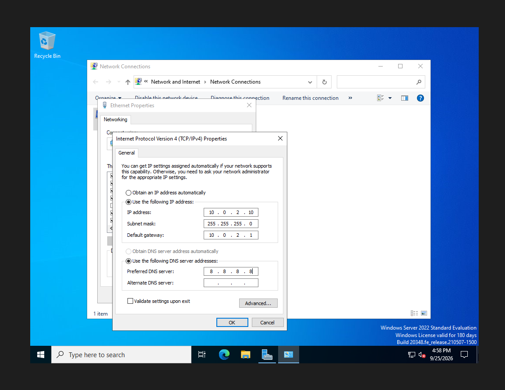
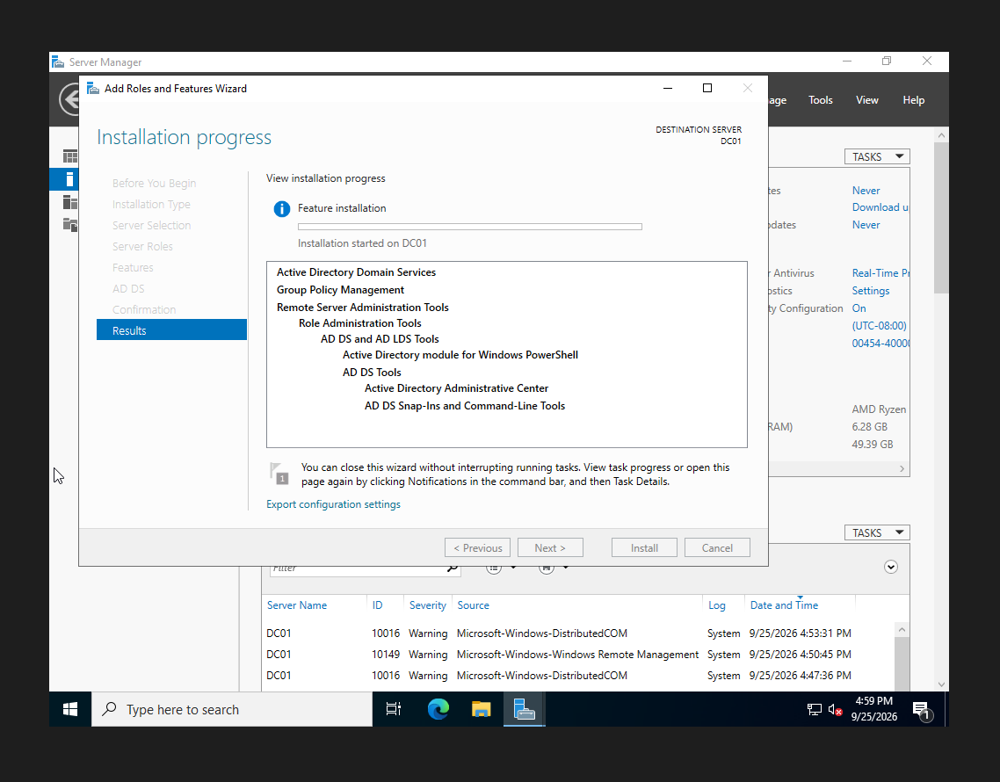
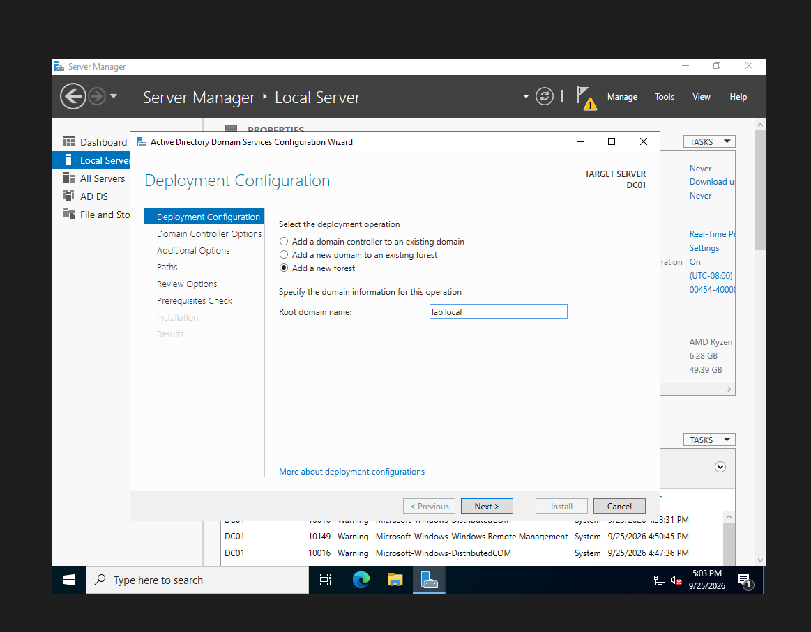
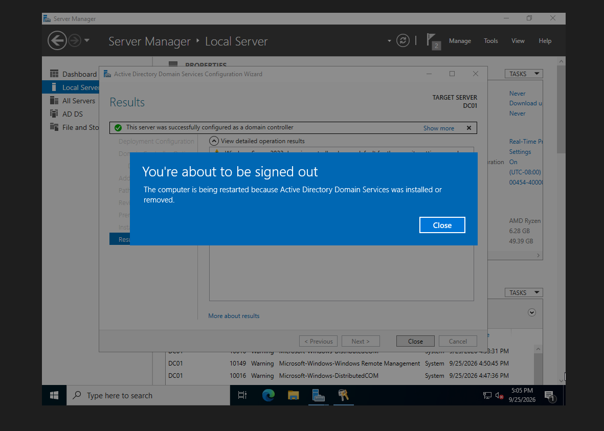
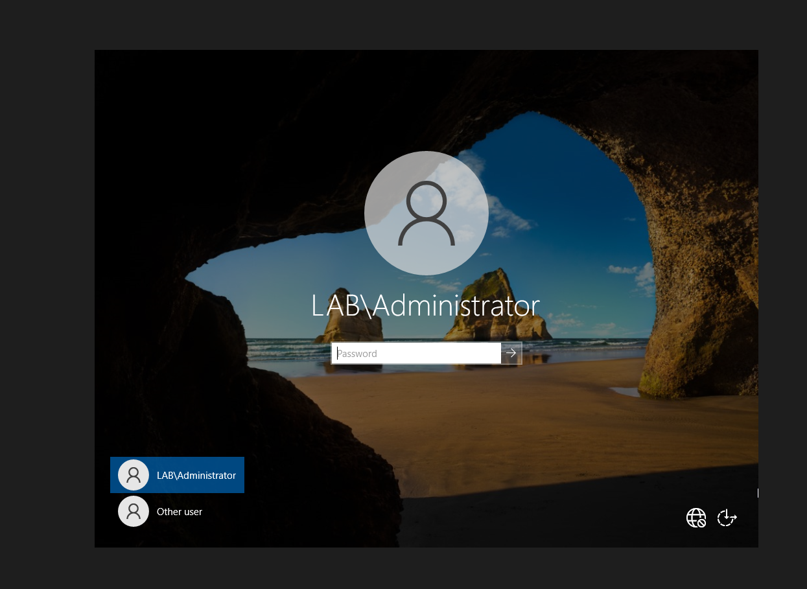
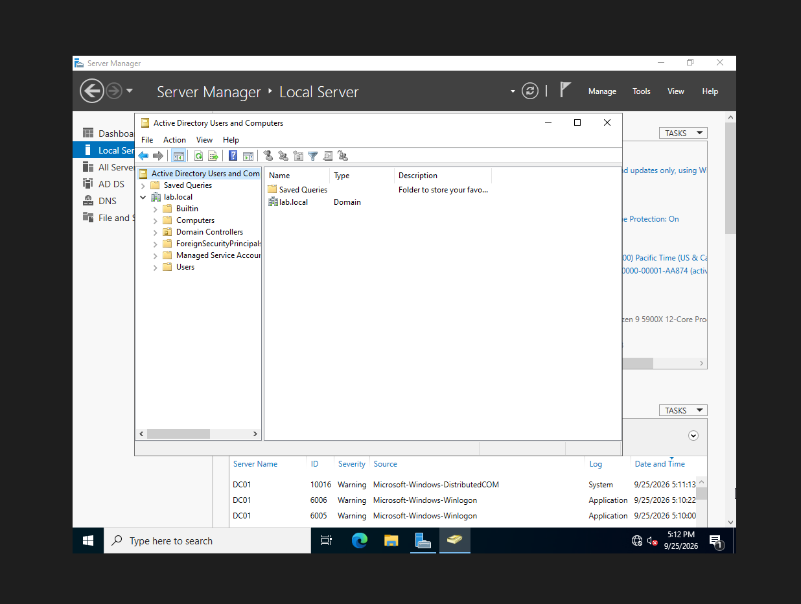
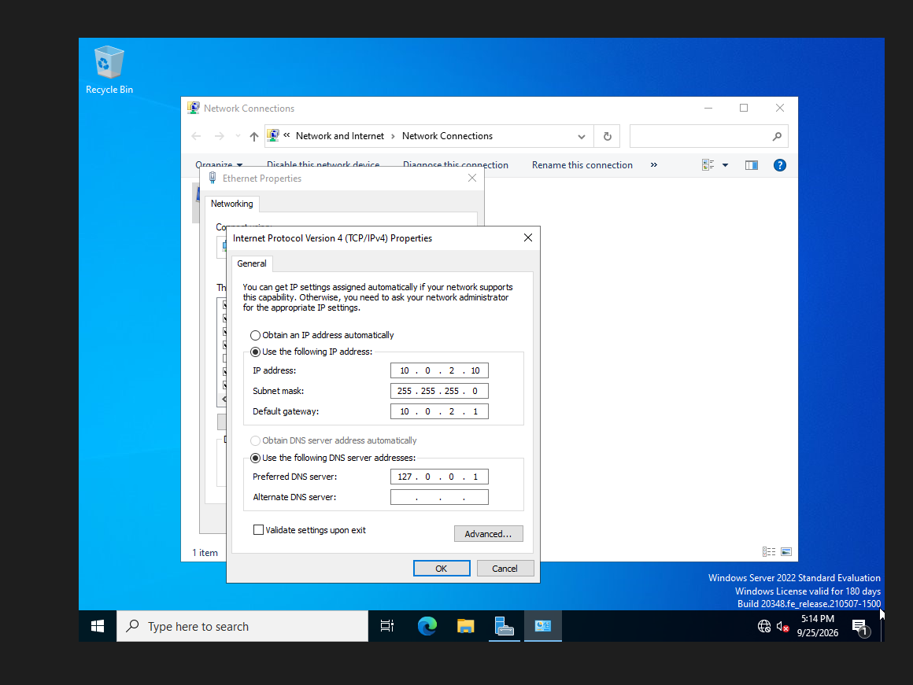

# 01 — Domain Controller Setup

## Steps
1. Installed **Windows Server 2022 Standard (Desktop Experience)** on a VirtualBox VM.
2. Installed VirtualBox Guest Additions.
3. Renamed the server to `DC01`.
4. Set a static IP: `10.0.2.10/24`, gateway `10.0.2.1`.
5. Installed the **Active Directory Domain Services** role.
6. Promoted the server to a domain controller in a new forest: `lab.local`.
7. Verified the domain in Active Directory Users and Computers and confirmed DNS points to `127.0.0.1`.

## Screenshots

