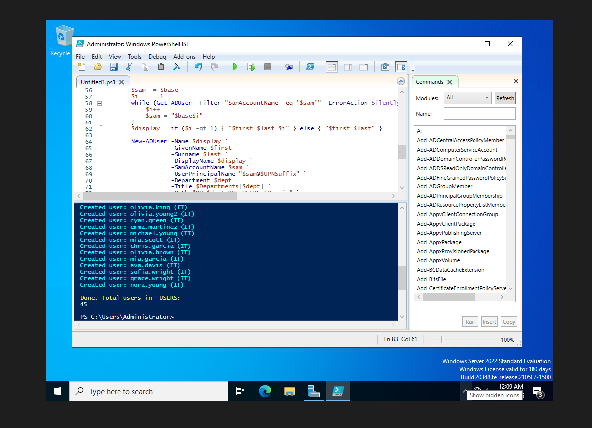
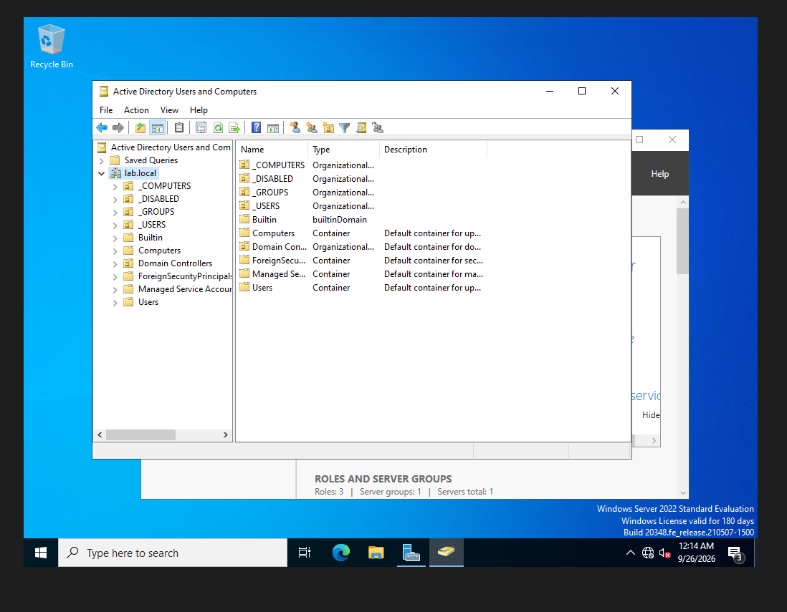
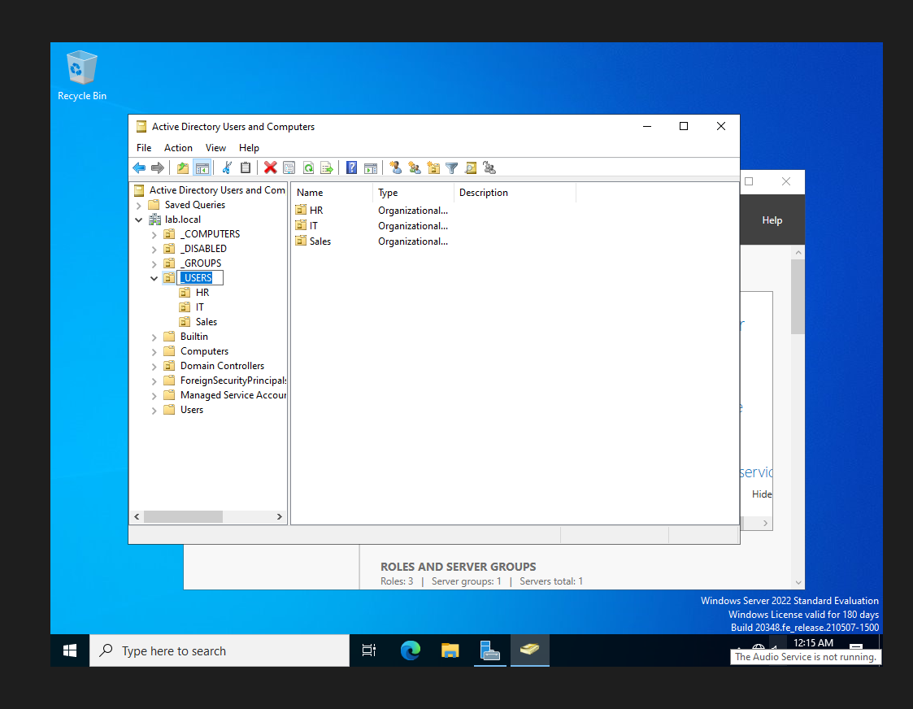
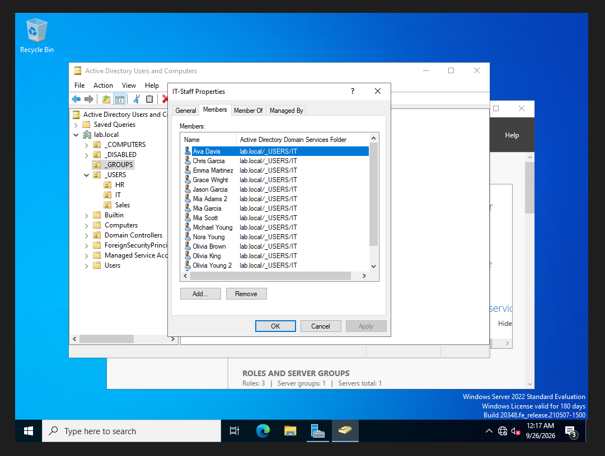
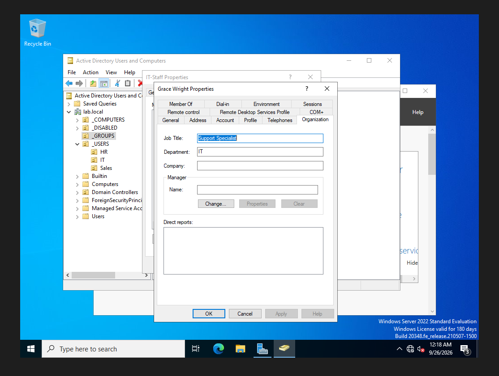

# 02 — OUs, Groups, and Bulk Users

## What the script does
[`Create-LabUsers.ps1`](../scripts/Create-LabUsers.ps1):
- Creates top-level OUs: `_USERS`, `_COMPUTERS`, `_GROUPS`, `_DISABLED`
- Creates department OUs: `HR`, `IT`, `Sales`
- Creates global security groups: `HR-Staff`, `IT-Staff`, `Sales-Staff`
- Creates 15 users per department with unique usernames (`first.last`), job title, and department
- Adds each user to their department group and forces a password change at first logon

## Screenshots

