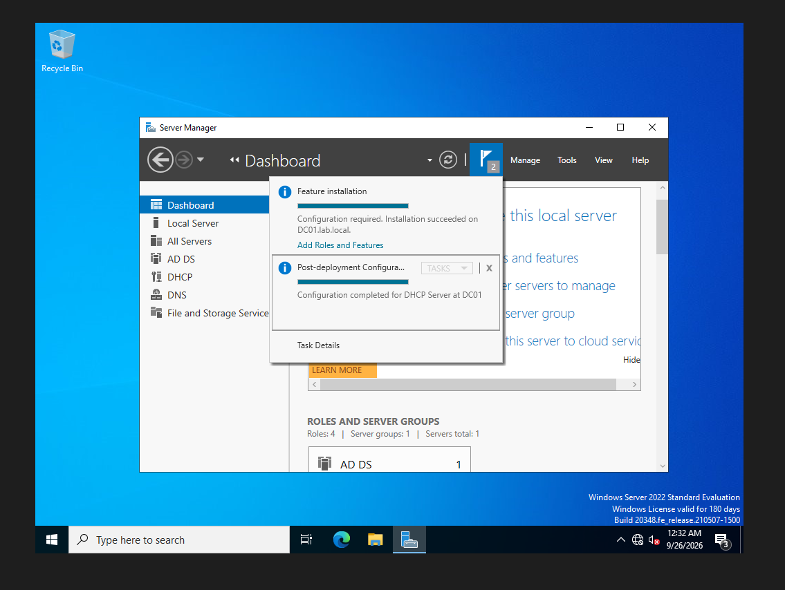
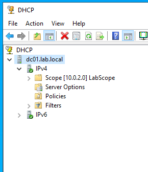
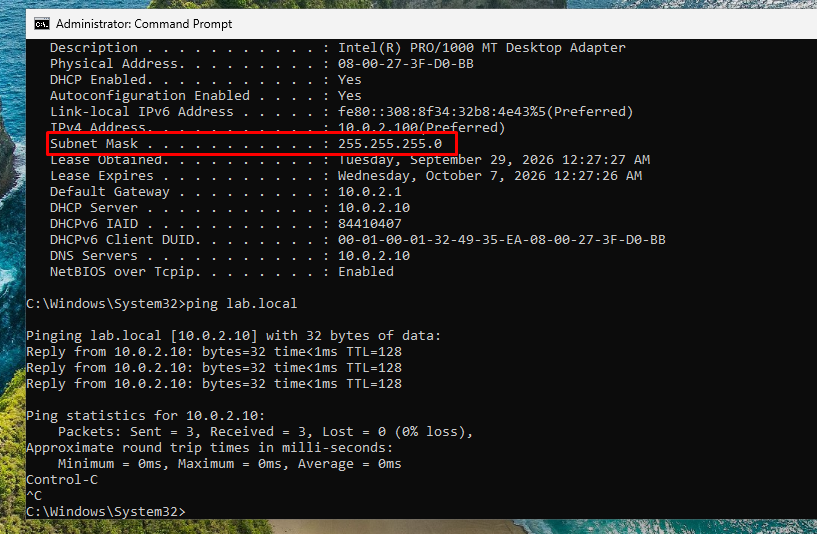
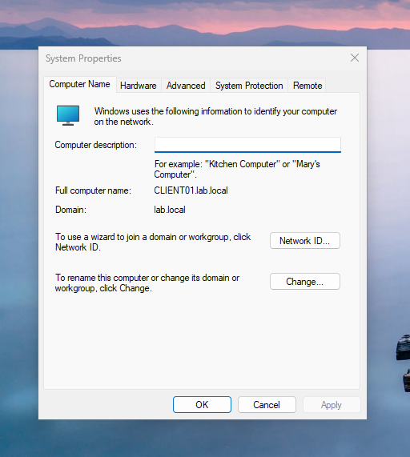
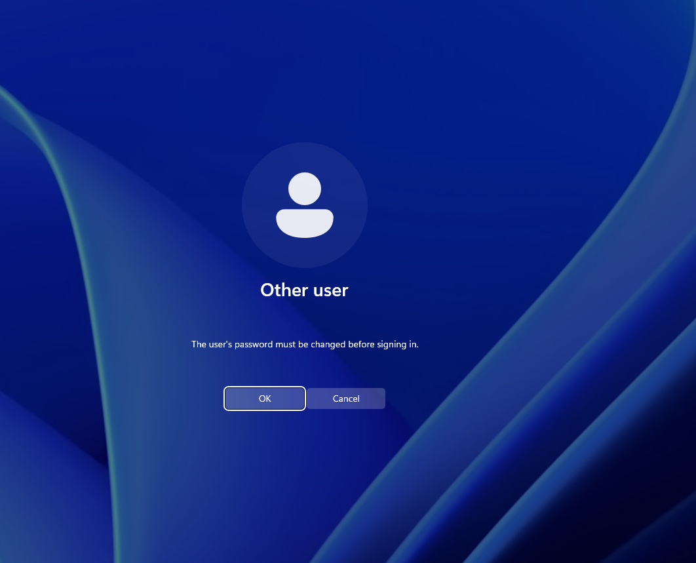
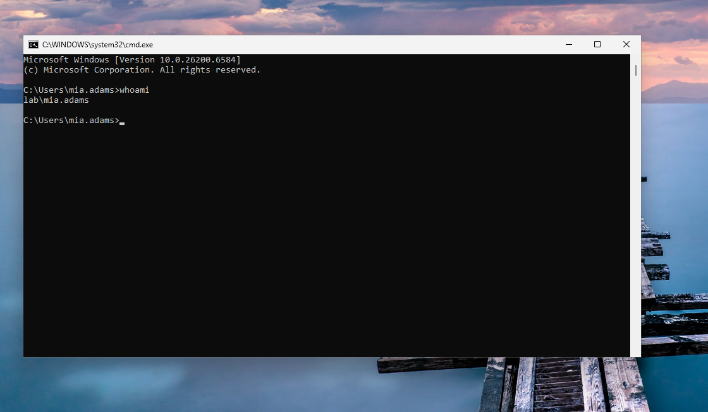
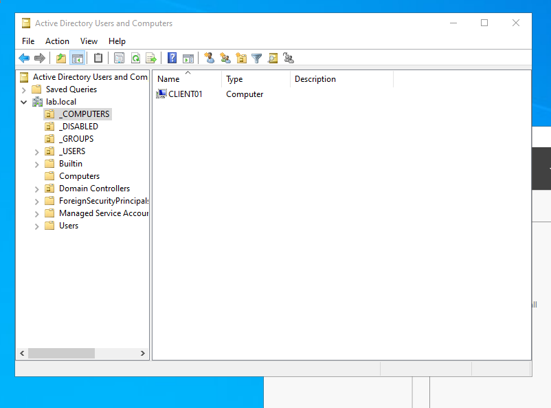

# 03 — DHCP and Joining a Client to the Domain

## DHCP
1. Disabled DHCP on the VirtualBox NAT Network so the domain controller handles addressing.
2. Installed the **DHCP Server** role on DC01 and authorized it in AD.
3. Created scope `LabScope`: `10.0.2.100–10.0.2.200`, router `10.0.2.1`, DNS `10.0.2.10`, domain `lab.local`.

## Client
1. Installed **Windows 11 Enterprise** on `CLIENT01`.
2. Verified networking with `ipconfig /all` (DNS = `10.0.2.10`) and `ping lab.local`.
3. Renamed the computer to `CLIENT01` and joined it to `lab.local`.
4. Logged in as a domain user and completed the forced password change.
5. Moved the computer object from `Computers` to the `_COMPUTERS` OU.

## Screenshots

