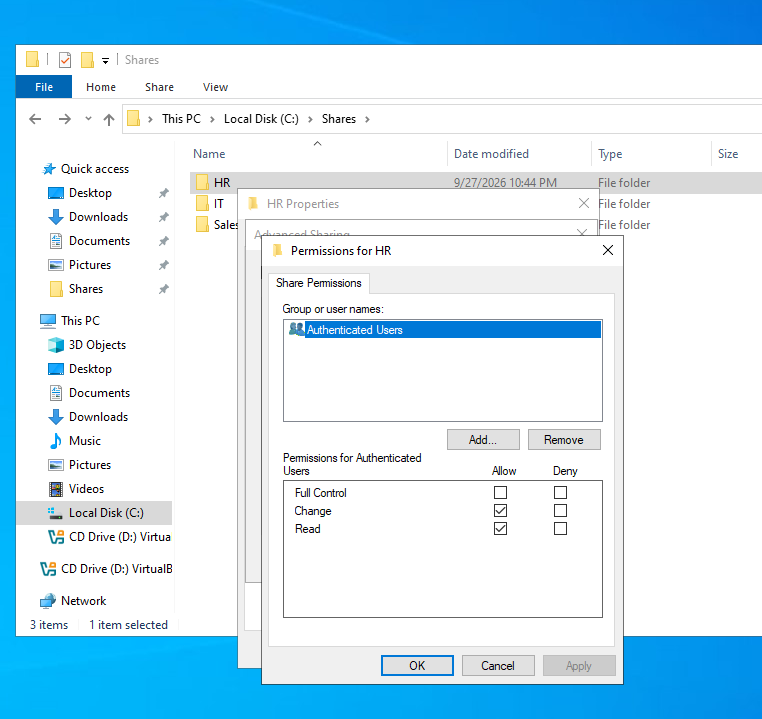
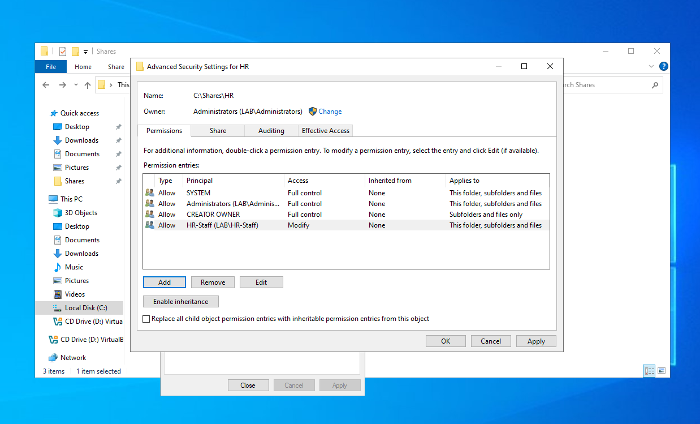
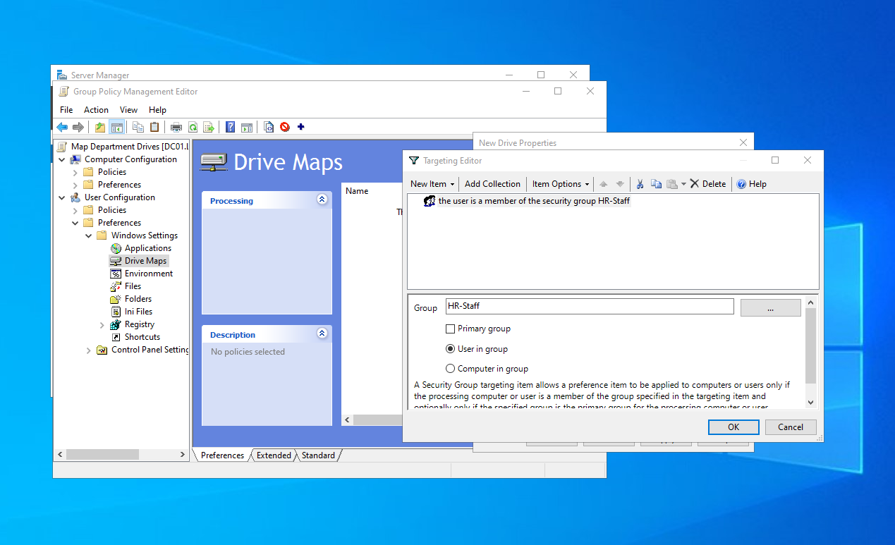
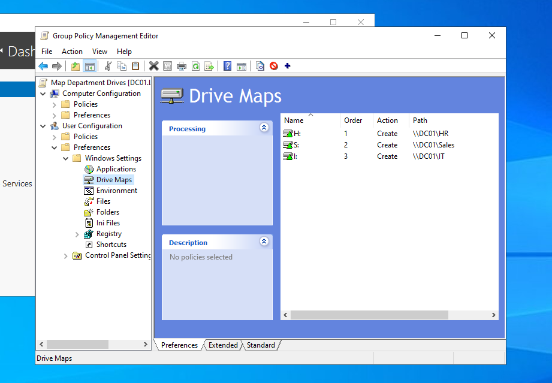
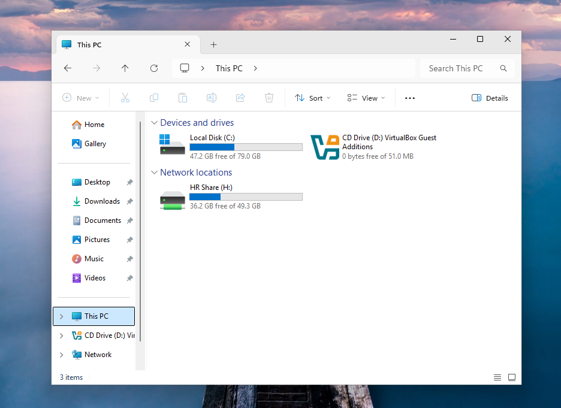
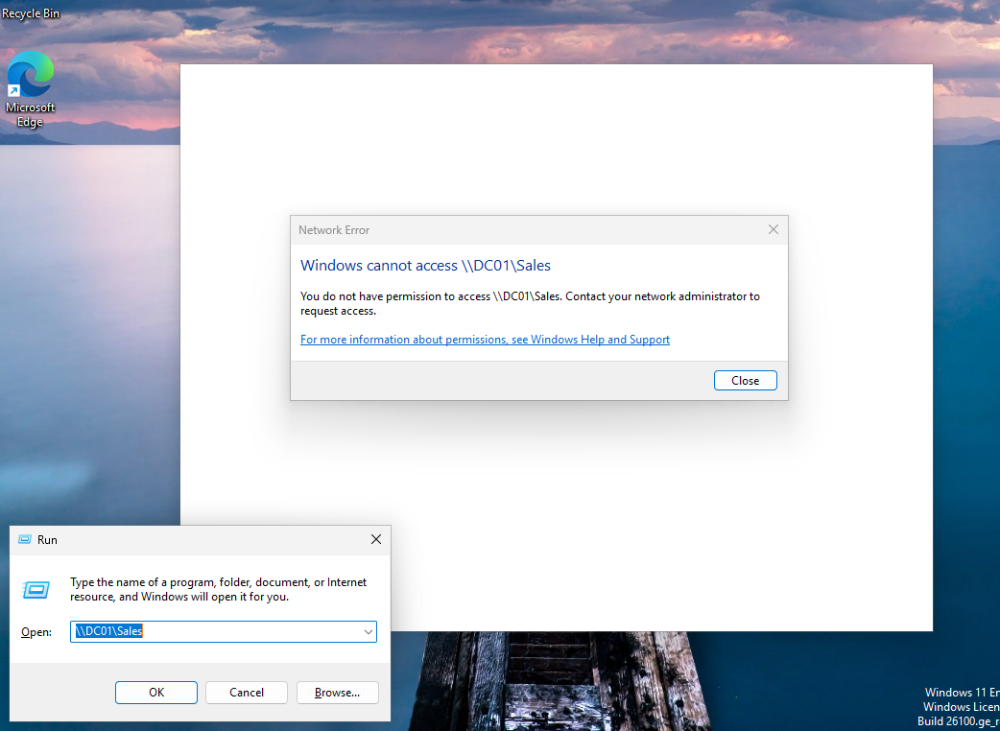
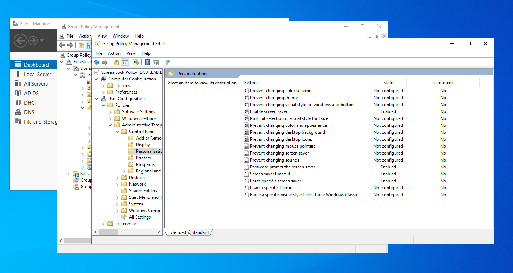
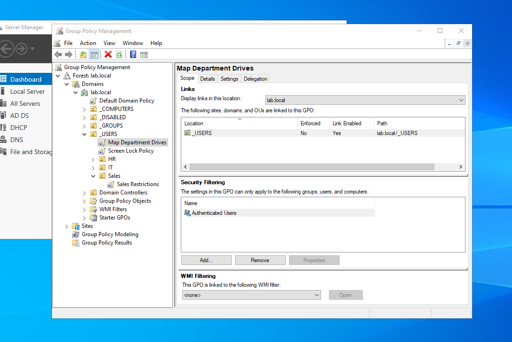
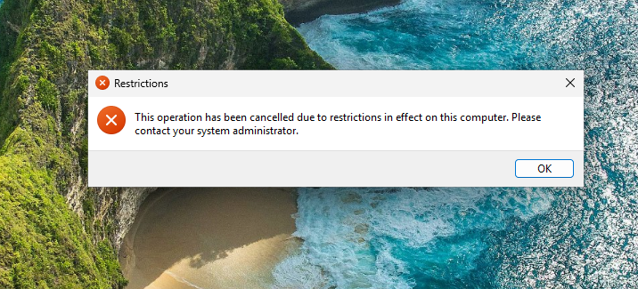
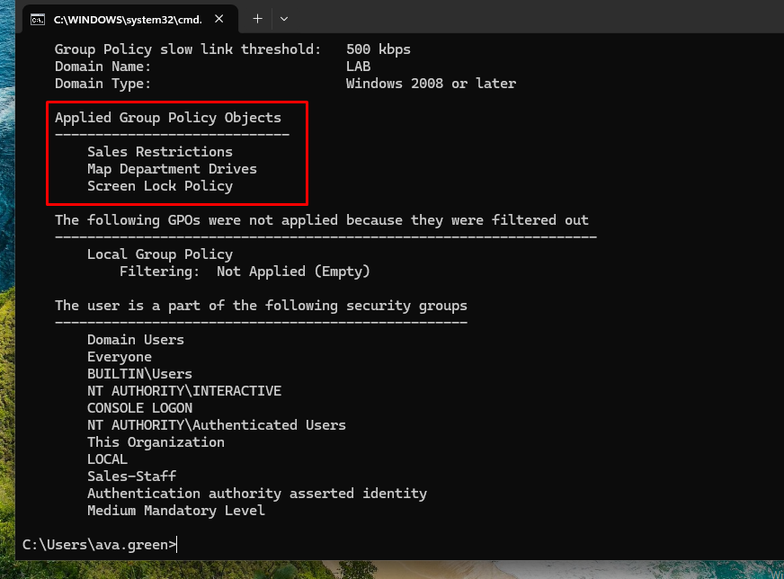

# 04 — File Shares and Group Policy

## Department File Shares
| Share | Path | NTFS Access |
|---|---|---|
| `\\DC01\HR` | `C:\Shares\HR` | HR-Staff: Modify |
| `\\DC01\IT` | `C:\Shares\IT` | IT-Staff: Modify |
| `\\DC01\Sales` | `C:\Shares\Sales` | Sales-Staff: Modify |

- **Share permissions:** Authenticated Users — Change/Read (broad)
- **NTFS permissions:** inheritance disabled, `Users` removed, department group granted Modify (restrictive)

> Share permissions apply only over the network; NTFS applies always. The effective permission is the most restrictive of the two, so access is controlled at the NTFS level.

## Group Policy Objects
| GPO | Linked to | Purpose |
|---|---|---|
| Map Department Drives | `_USERS` | Maps H:, I:, S: using item-level targeting by security group |
| Screen Lock Policy | `_USERS` | Password-protected screen saver after 10 minutes |
| Sales Restrictions | `_USERS/Sales` | Blocks Control Panel and PC Settings |

## Verification
- Department users see only their own mapped drive.
- Accessing another department's share returns **Access denied**.
- `gpresult /r` confirms applied GPOs and security group membership.

## Screenshots

