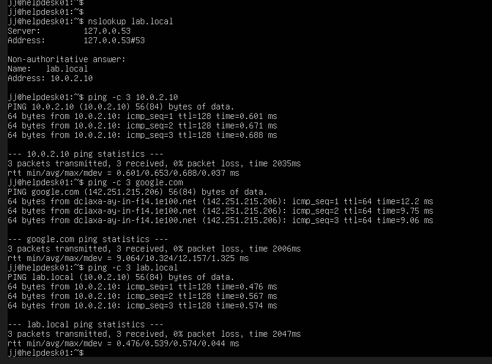
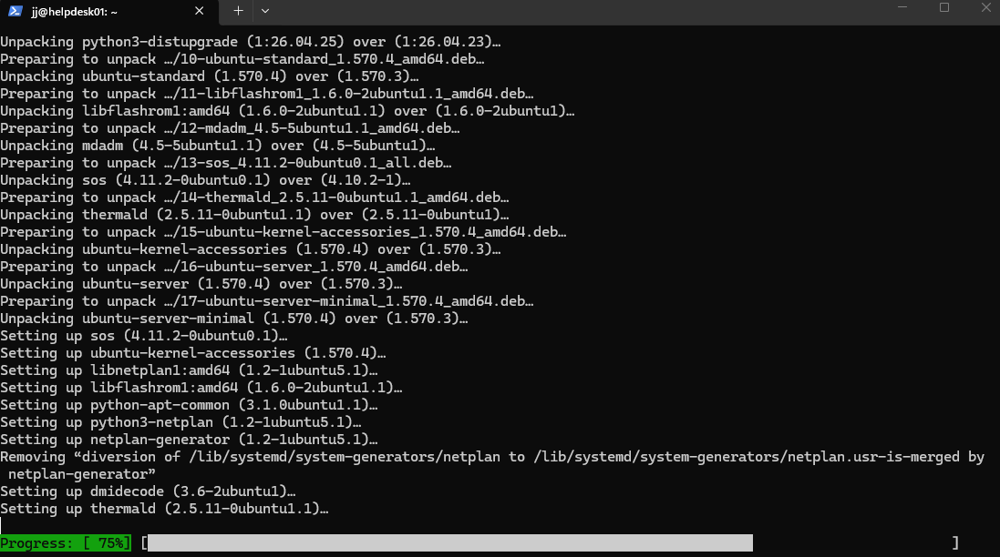
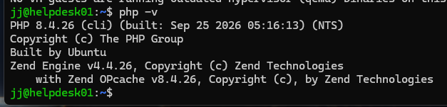
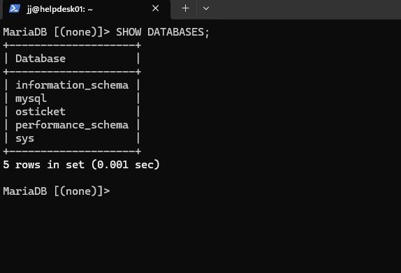
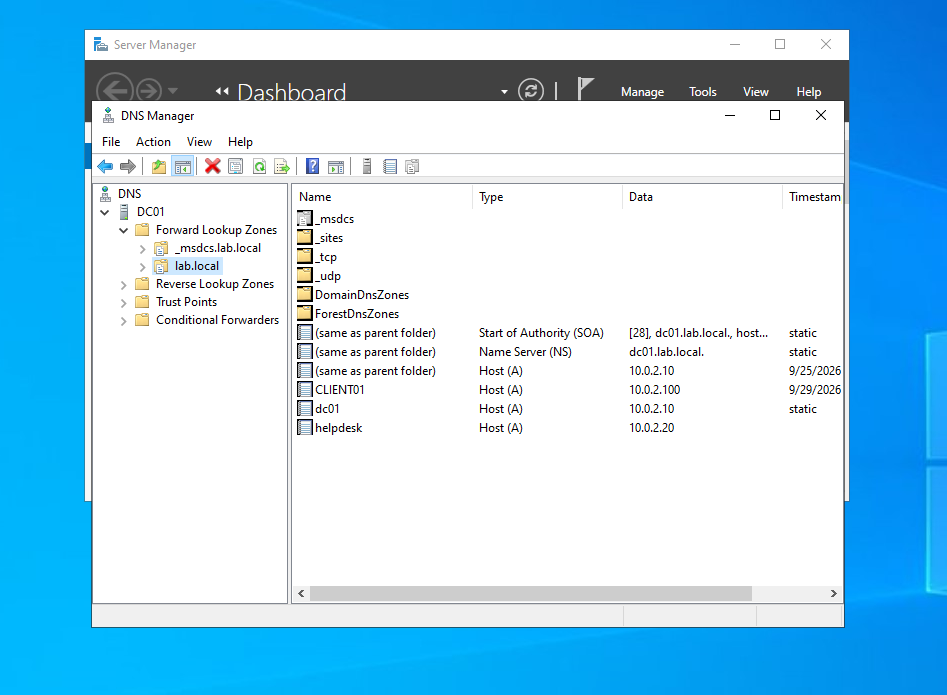
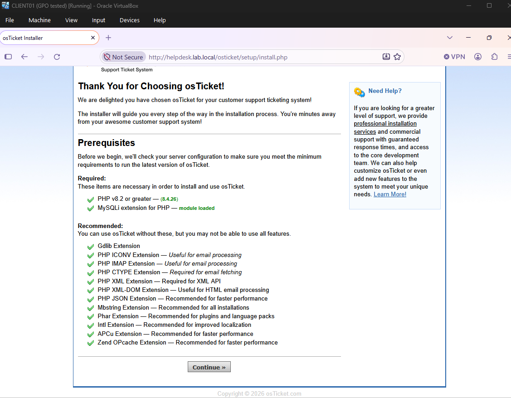
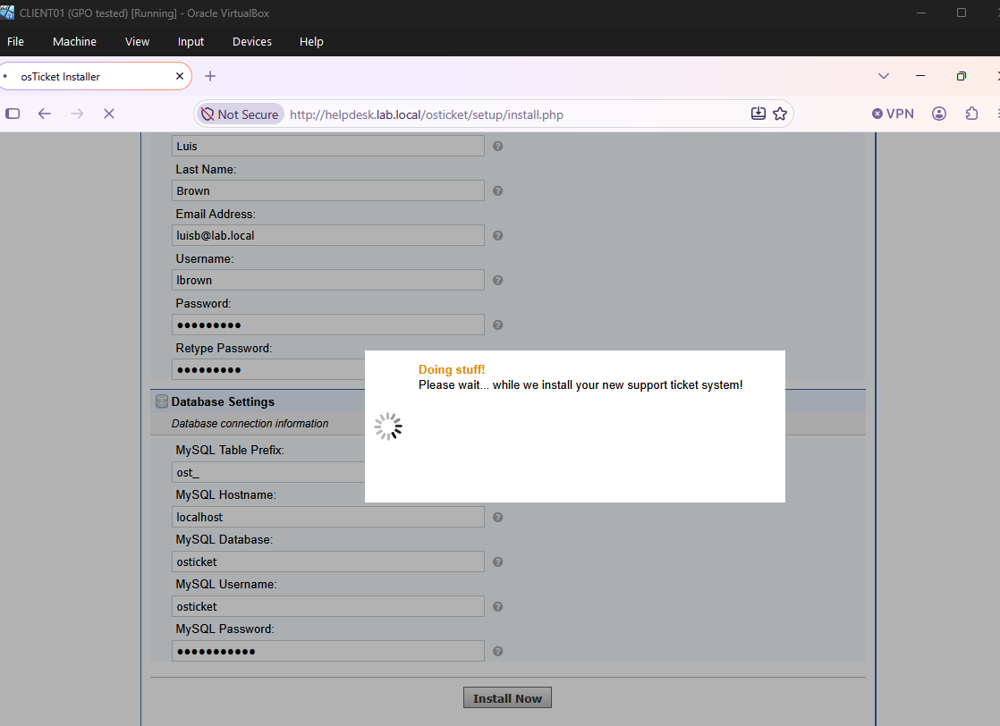
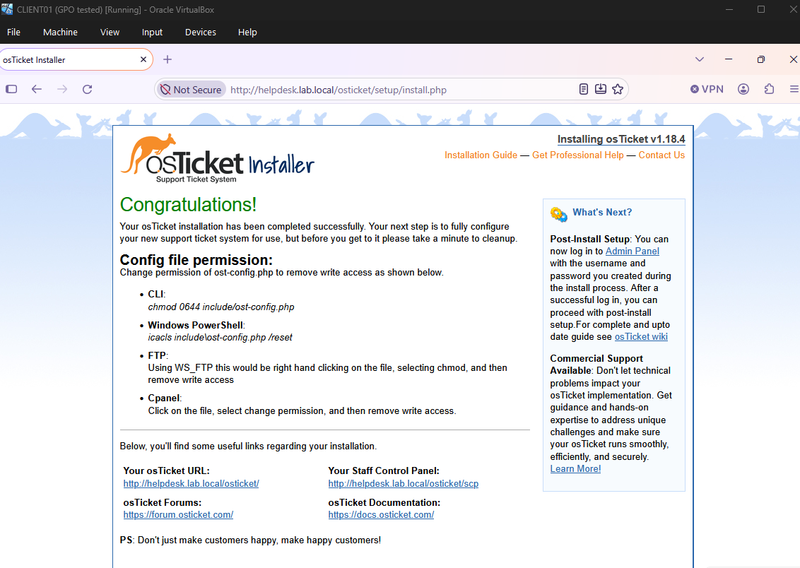
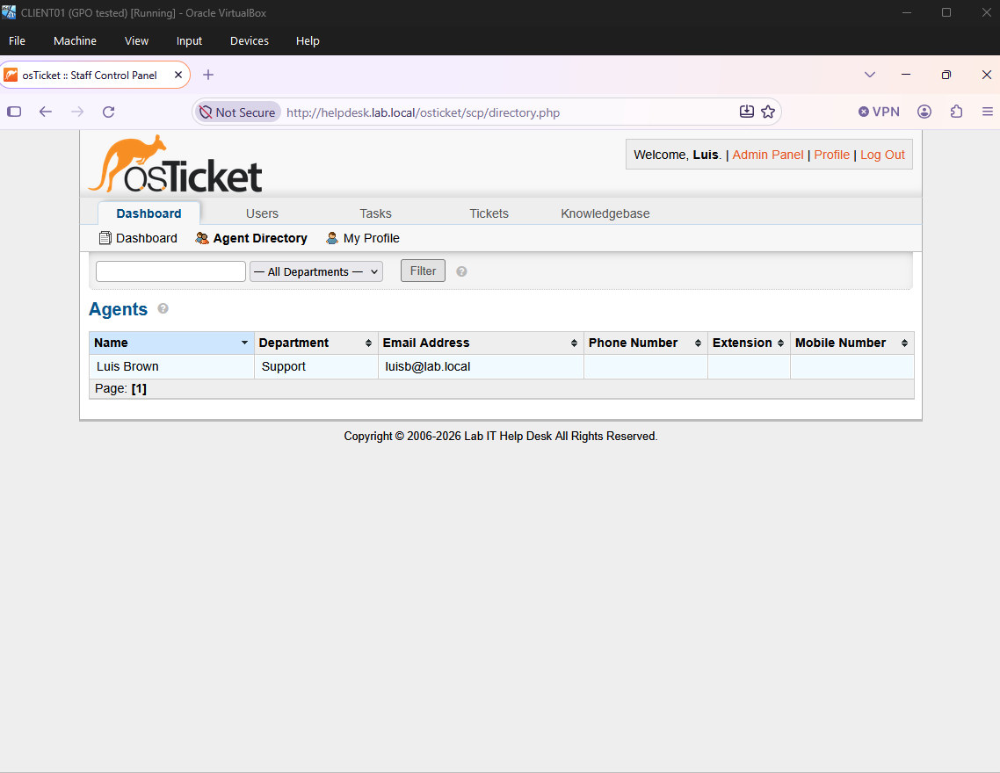
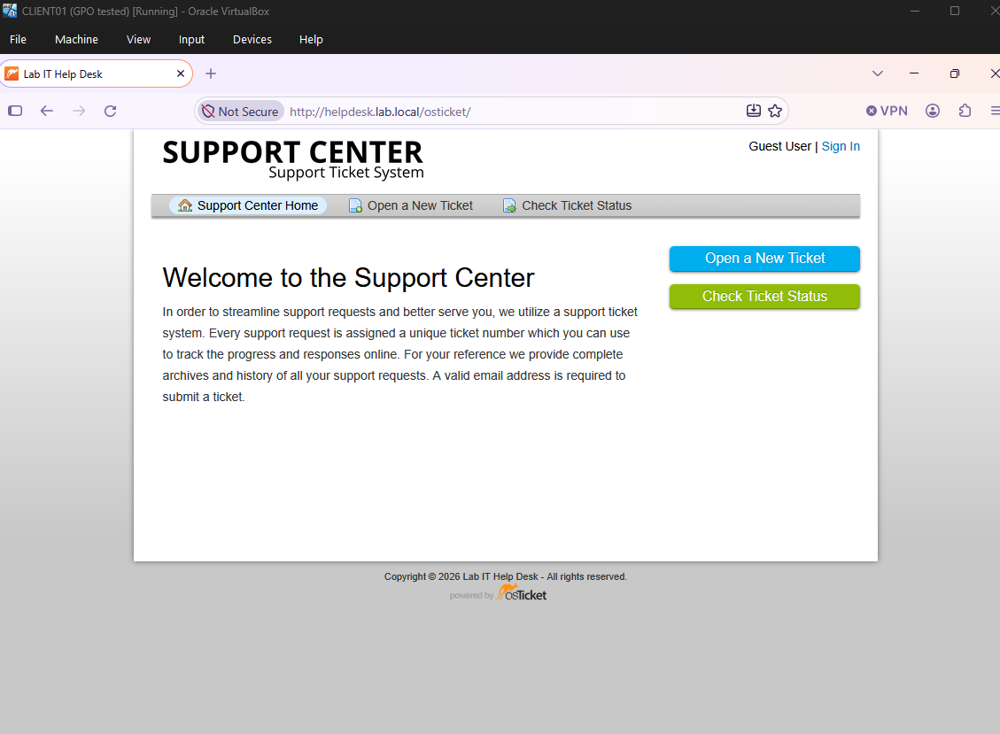

# 05 — osTicket Server Installation

Added a third VM, **HELPDESK01**, running osTicket so tickets are tracked in a real ticketing system instead of only in documentation.

| Item | Value |
|---|---|
| OS | Ubuntu Server 26.04 LTS |
| IP / DNS | `10.0.2.20` — `helpdesk.lab.local` (A record on DC01) |
| Stack | Apache 2.4, MariaDB, PHP 8.4 |
| App | osTicket v1.18.4 |

## Steps
1. Installed Ubuntu Server with a static IP and DC01 as the DNS server; verified name resolution and connectivity with `nslookup` and `ping`.
2. Connected over SSH through a VirtualBox NAT port forward (host 2222 → 10.0.2.20:22).
3. Installed Apache, MariaDB, and PHP extensions required by osTicket.
4. Created the `osticket` database and a dedicated database user.
5. Deployed osTicket to `/var/www/html/osticket` and created an A record `helpdesk` in AD DNS.
6. Ran the web installer from CLIENT01, then locked `ost-config.php` (0644) and removed the `setup` directory.

## Issue encountered: PHP version
Ubuntu 26.04 ships **PHP 8.5**, but osTicket 1.18.4 supports PHP 8.2–8.4. The old Ondřej PPA returned **404** for Ubuntu Resolute, so PHP 8.4 was installed from the **packages.sury.org** repository instead. `php8.3-imap` from the original instructions did not exist on this release.

## Screenshots

