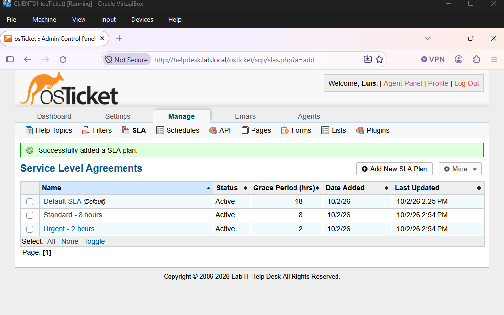
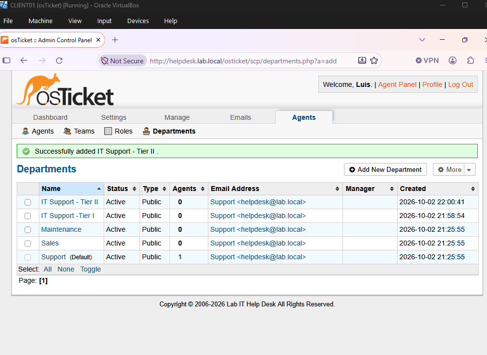
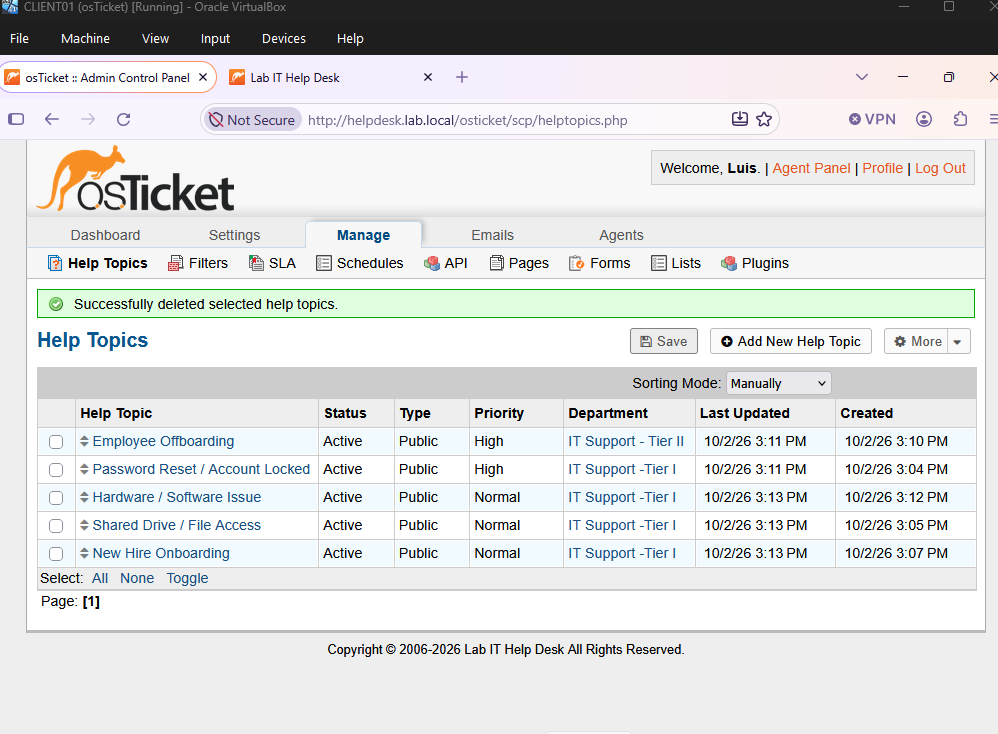
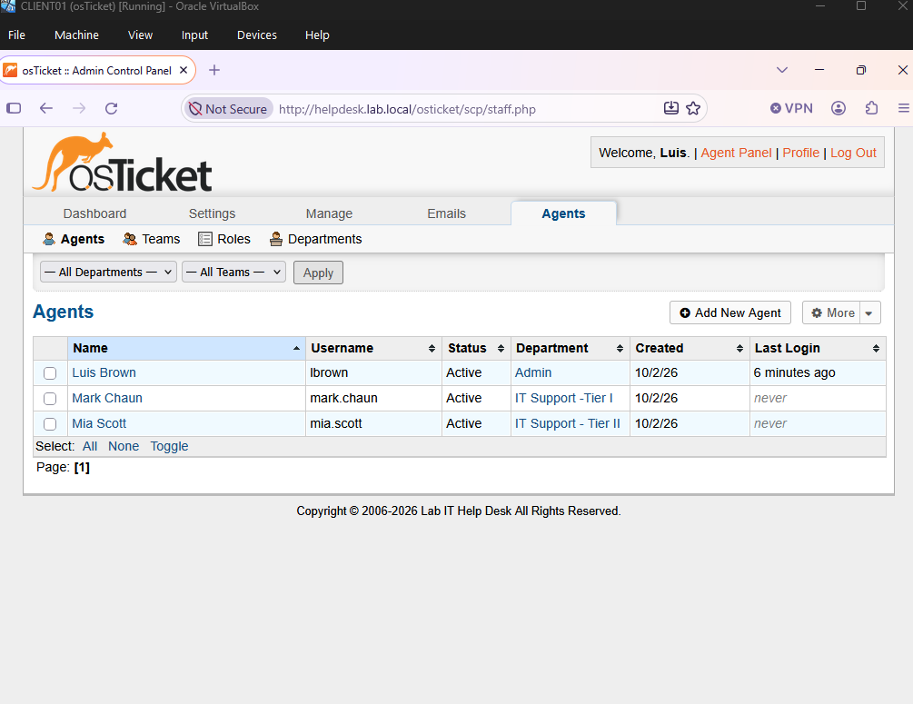
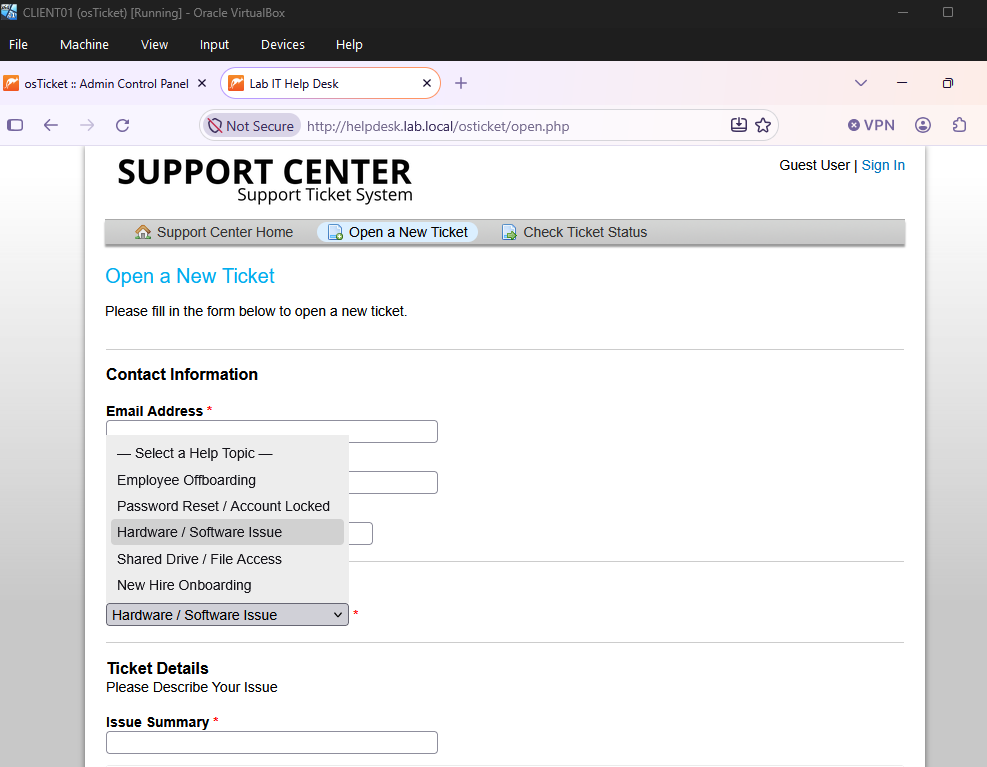

# 06 — osTicket Configuration (Tiered Support)

## SLA Plans
| SLA | Grace period |
|---|---|
| Urgent - 2 hours | 2 h |
| Standard - 8 hours | 8 h |

## Departments
| Department | Role |
|---|---|
| IT Support - Tier I | First line: passwords, access, onboarding, hardware/software |
| IT Support - Tier II | Escalations and security-sensitive work (offboarding) |

## Help Topics (automatic routing)
| Help Topic | Department | Priority | SLA |
|---|---|---|---|
| Password Reset / Account Locked | Tier I | High | Urgent - 2 hours |
| Shared Drive / File Access | Tier I | Normal | Standard - 8 hours |
| New Hire Onboarding | Tier I | Normal | Standard - 8 hours |
| Hardware / Software Issue | Tier I | Normal | Standard - 8 hours |
| Employee Offboarding | **Tier II** | High | Urgent - 2 hours |

Offboarding routes straight to Tier II with high priority because an active account for a departed employee is a security risk.

## Agents
| Agent | Department |
|---|---|
| Luis Brown | Admin (administrator account) |
| Mark Chaun | Tier I |
| Mia Scott | Tier II |

## Screenshots

