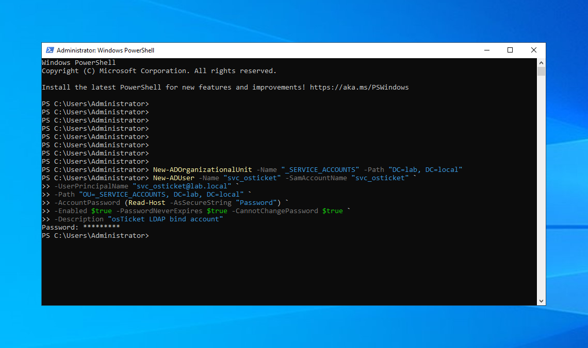
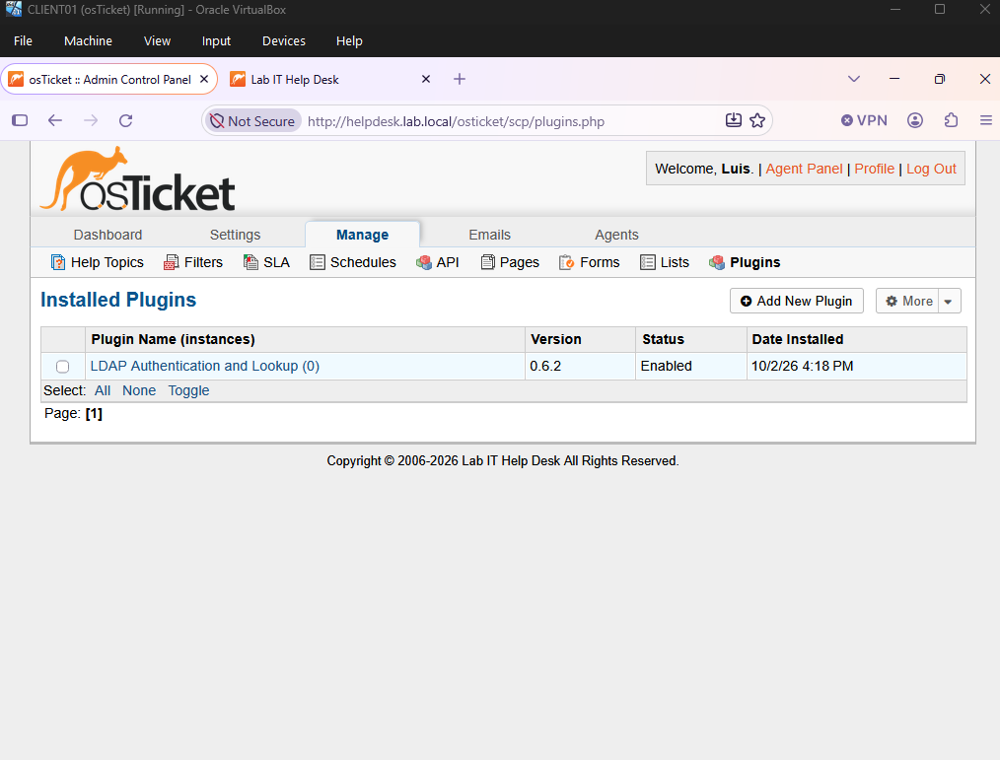
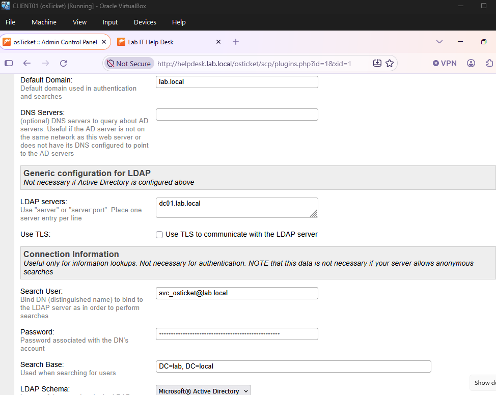
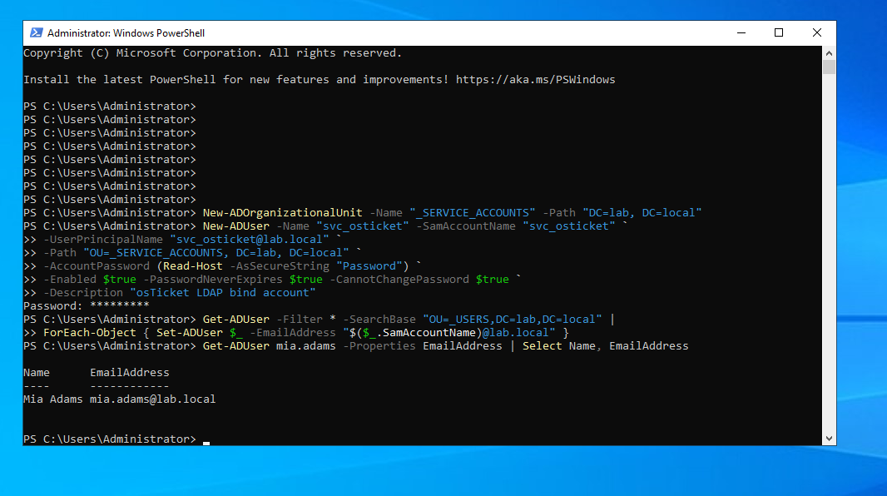
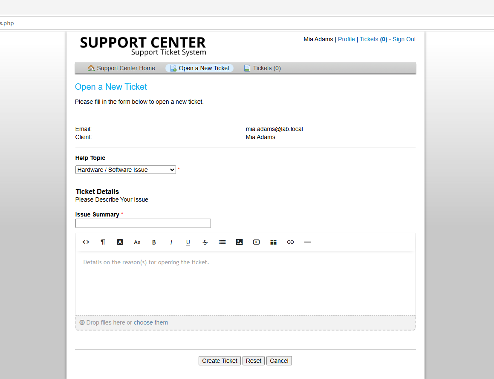
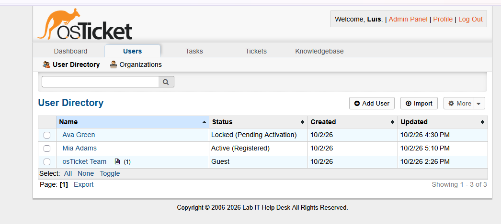
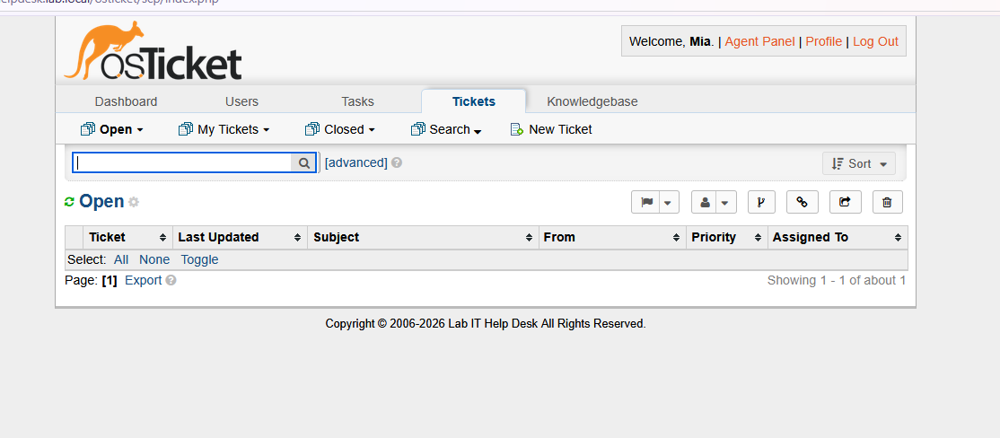

# 07 — osTicket + Active Directory (LDAP)

Users sign in to the portal and agents sign in to the staff panel with their **domain credentials**.

## Steps
1. Created a dedicated bind account `svc_osticket` in a separate `_SERVICE_ACCOUNTS` OU (password never expires, cannot change password) so it is not affected by user GPOs.
2. Installed `php8.4-ldap` and the osTicket **LDAP Authentication and Lookup** plugin.
3. Configured a plugin instance: domain `lab.local`, server `dc01.lab.local`, search base `DC=lab,DC=local`, schema Microsoft Active Directory, agent and client authentication enabled.
4. Enabled public registration so AD users get an osTicket account automatically on first sign-in.
5. Switched agent Mia Scott's authentication backend to the AD instance.

## Issues encountered
| Problem | Cause | Fix |
|---|---|---|
| First AD sign-in showed a registration form asking for an email | AD user objects had an empty `mail` attribute | Populated email for all users with PowerShell: `Set-ADUser -EmailAddress "<sam>@lab.local"` |
| Agent Mia Scott got **Access denied** | `pwdLastSet = 0` (must change password at next logon) blocks LDAP binds; failed attempts also **locked** the account | Unlocked the account, reset the password, and cleared the flag — documented as ticket [OT-3](../tickets/osticket/OT-3-agent-login.md) |

> Failed osTicket logins count toward the AD lockout policy (3 attempts), so repeated retries lock the user out.

## Screenshots

