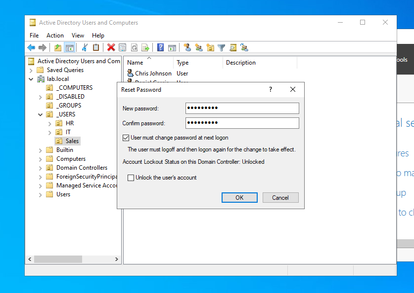
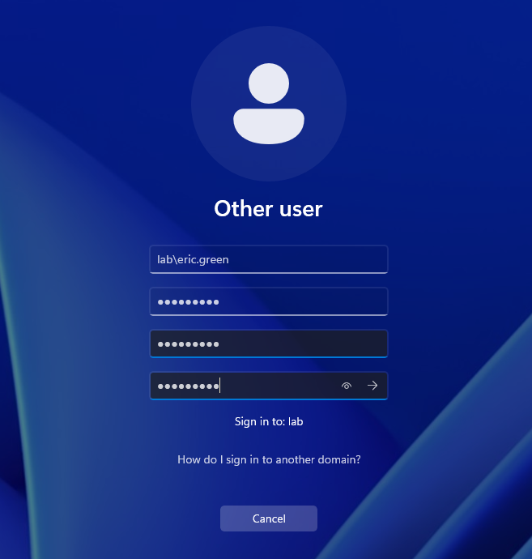
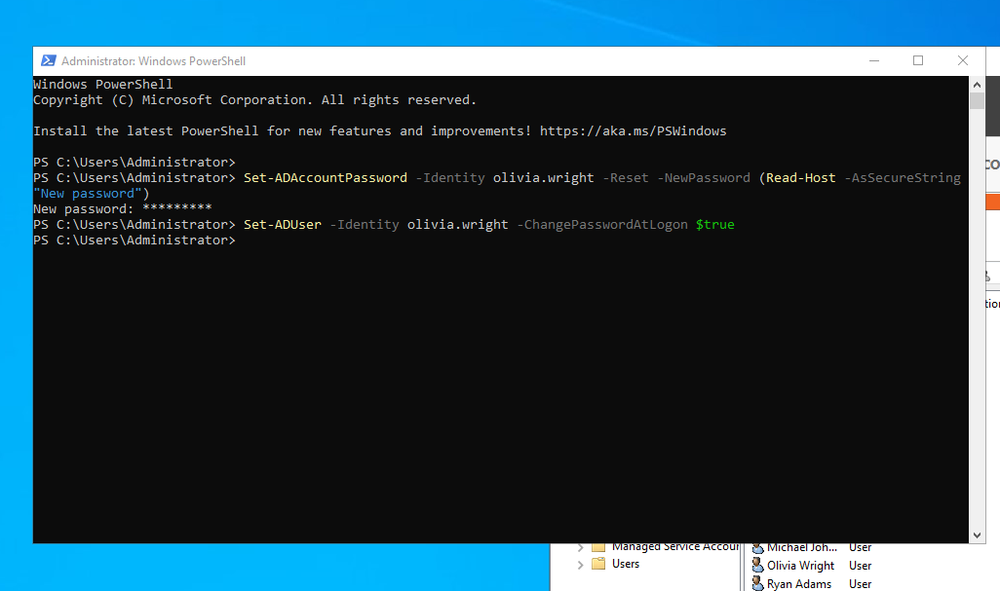

# Ticket #001 — Password Reset

**Reported issue:** Sales employee forgot their password and cannot log in.
**Priority:** Medium

**Troubleshooting:**
- Verified the user account exists and is enabled in ADUC.
- Confirmed the account was not locked out.

**Resolution:**
- Reset the password in ADUC and enabled *User must change password at next logon*.
- User logged in on CLIENT01 and set a new password.

**PowerShell equivalent:**
```powershell
Set-ADAccountPassword -Identity <username> -Reset -NewPassword (Read-Host -AsSecureString "New password")
Set-ADUser -Identity <username> -ChangePasswordAtLogon $true
```

**Tools used:** ADUC, PowerShell




