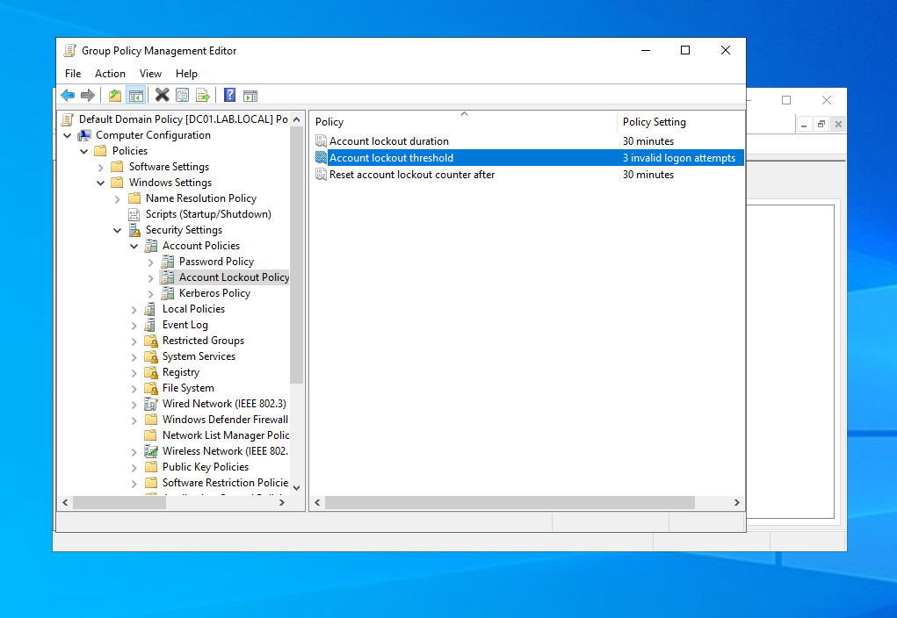
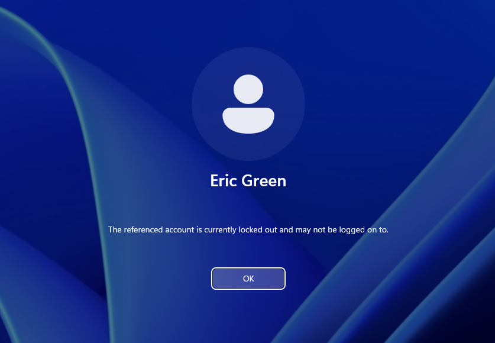
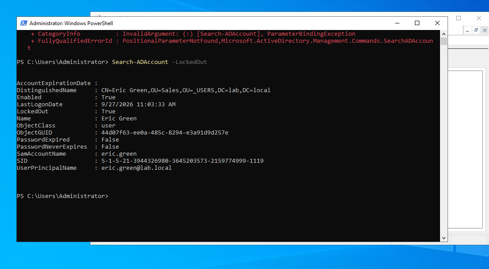
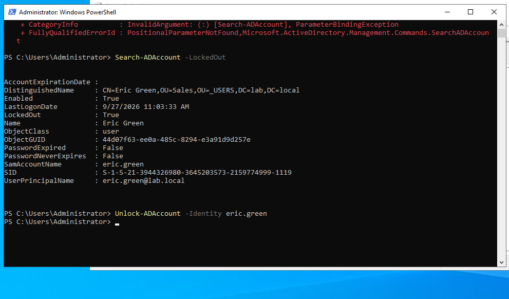

# Ticket #002 — Account Locked Out

**Reported issue:** User entered the wrong password several times and is now locked out.
**Priority:** High (user cannot work)

**Setup:** Configured Account Lockout Policy in the Default Domain Policy (threshold: 3 attempts, 30-minute duration).

**Troubleshooting:**
- Reproduced the issue with 3 failed logons on CLIENT01.
- Identified locked accounts with `Search-ADAccount -LockedOut`.

**Resolution:**
- Unlocked the account (ADUC → Account tab → *Unlock account*, or `Unlock-ADAccount -Identity <username>`).
- User logged in successfully with the correct password.

**Tools used:** Group Policy Management, ADUC, PowerShell

