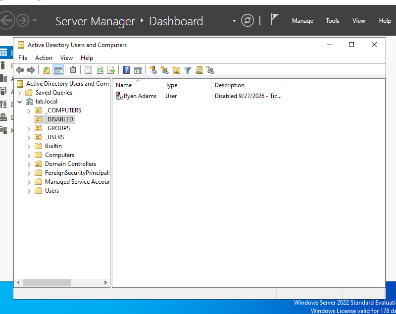
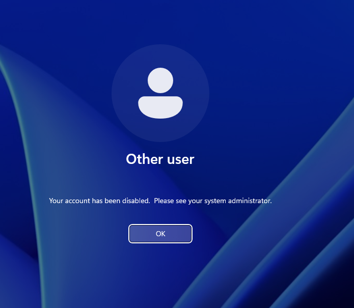

# Ticket #004 — Employee Offboarding

**Request:** Sales employee left the company today; remove access.
**Priority:** High (security)

**Resolution:**
- **Disabled** the account instead of deleting it, to preserve data and audit history.
- Removed the user from `Sales-Staff` (kept only Domain Users).
- Added a description with the date and ticket number.
- Moved the account to the `_DISABLED` OU.
- Verified that login on CLIENT01 fails with *Your account has been disabled*.

**Tools used:** ADUC

