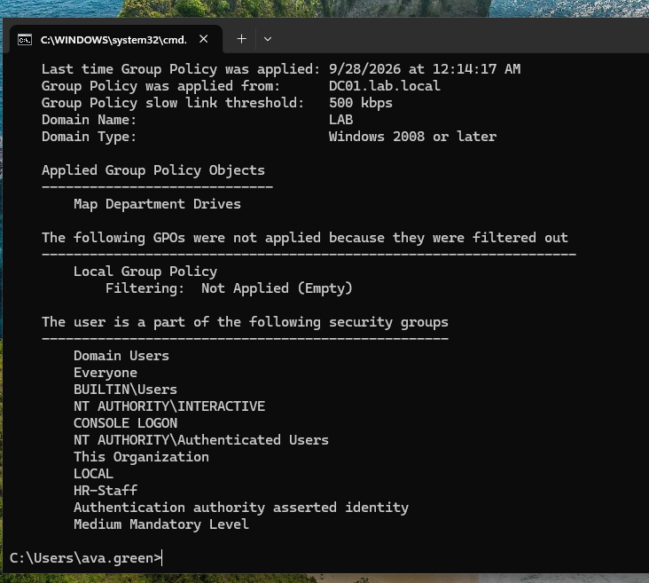
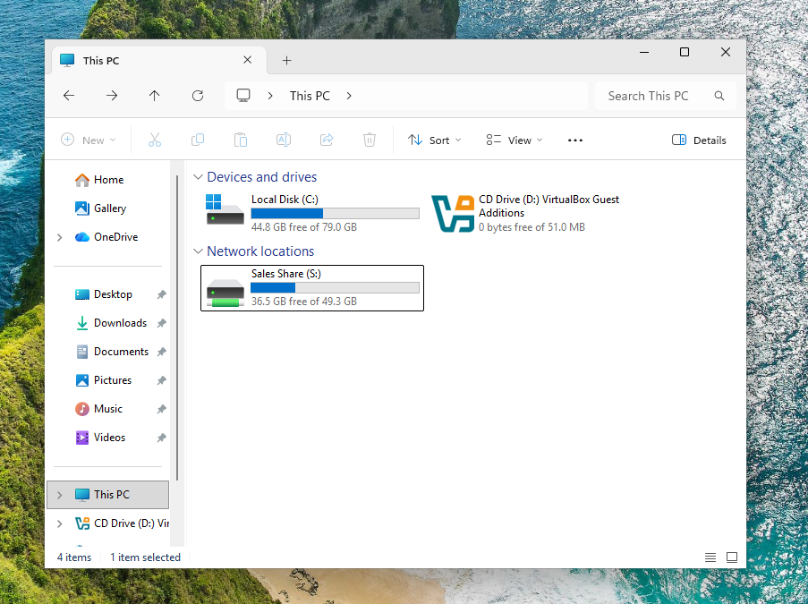
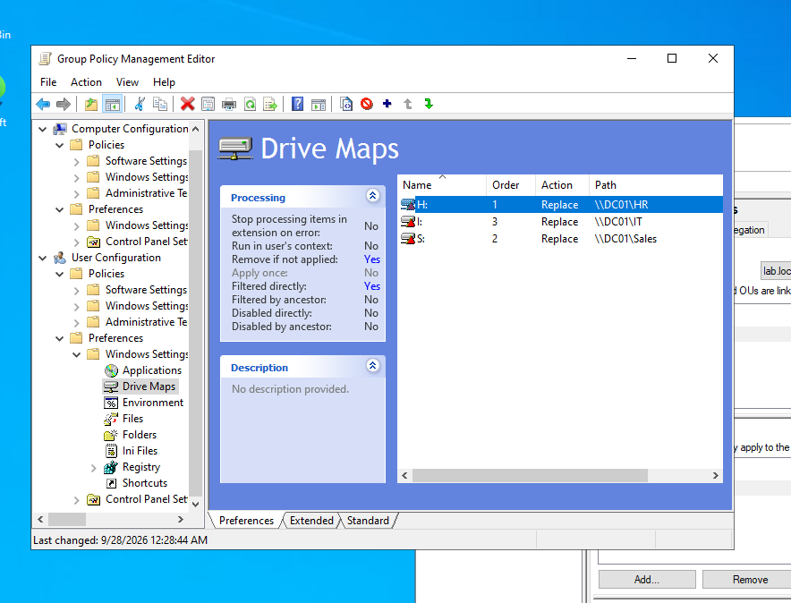

# Ticket #005 — Shared Drive Not Showing

**Reported issue:** User transferred from HR to Sales, but the Sales drive (S:) does not appear.
**Priority:** Medium

**Troubleshooting:**
- Ran `gpresult /r` on CLIENT01: `Sales-Staff` was missing from the user's security groups.

**Resolution:**
- Added the user to `Sales-Staff` and removed them from `HR-Staff`.
- Moved the user account from the `HR` OU to the `Sales` OU so Sales-specific GPOs also apply.
- Had the user **log off and log back on**: group membership is read into the access token only at logon.
- Drive S: appeared. The H: mapping still showed but was no longer accessible (NTFS access removed with the group).
- Follow-up: changed each drive map's action to **Replace** and enabled **Remove this item when it is no longer applied**, so stale drives are removed automatically at the next logon. After re-logon only S: remained.

**Key takeaways:**
- Group Policy Preference items are not removed automatically unless *Remove this item when it is no longer applied* is enabled.
- Drive mappings here are targeted by **security group**; GPO links apply by **OU location**. A transfer requires updating both.
- Group changes take effect only after a new logon.

**Tools used:** ADUC, `gpresult /r`

