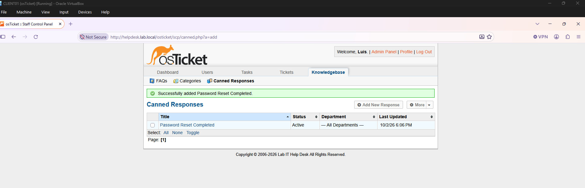
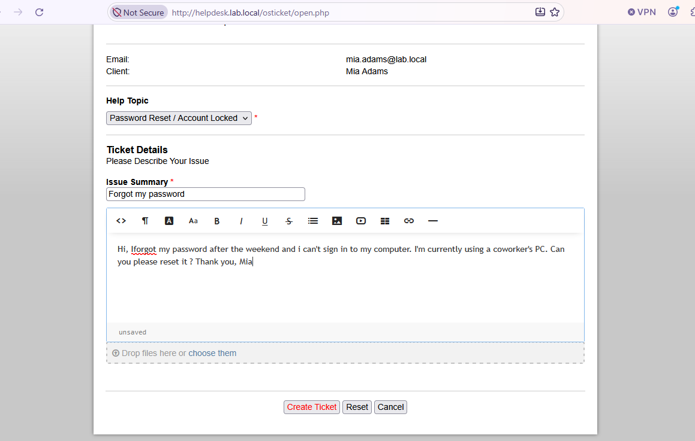
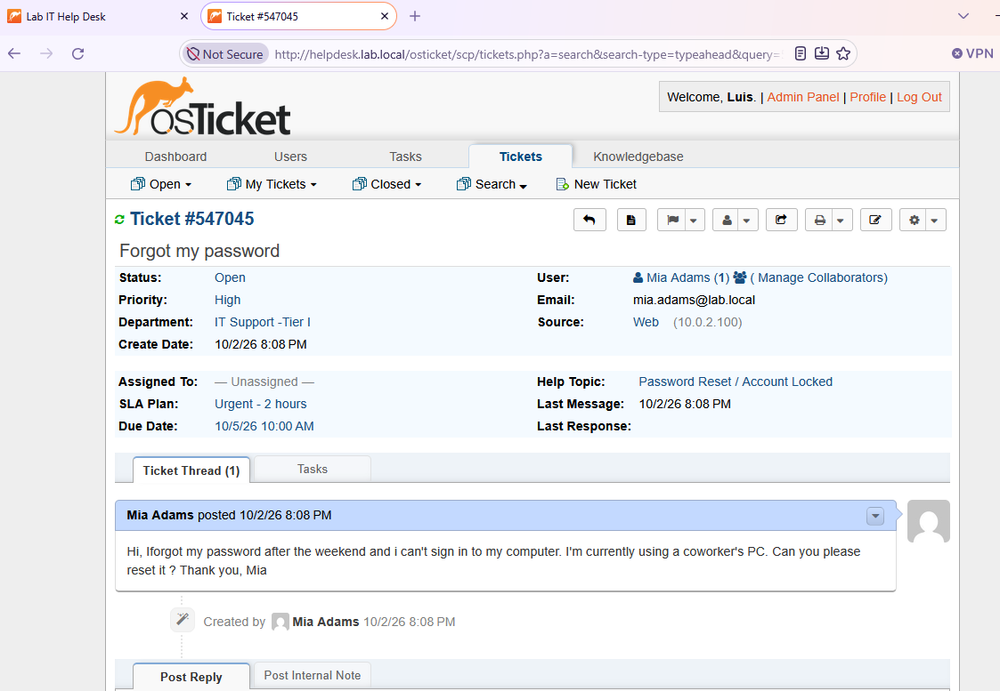
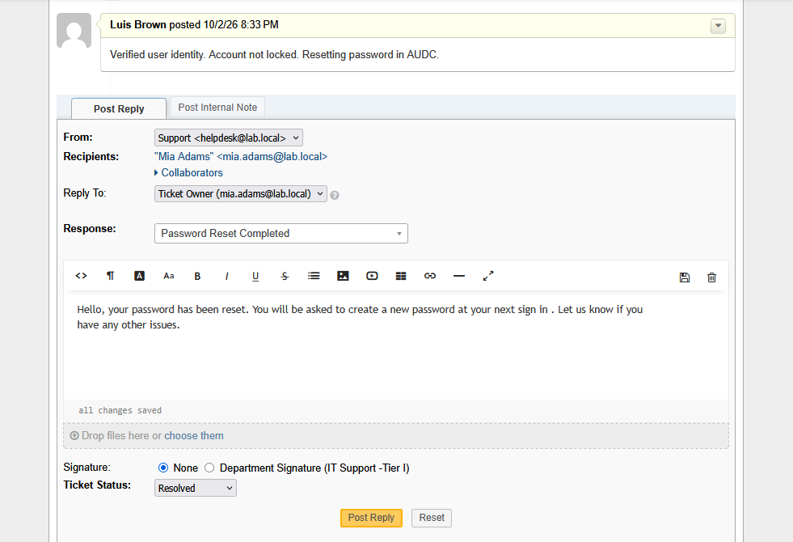

# OT-1 — Forgot Password (Ticket #547045)

**Channel:** User portal (Web) · **Help Topic:** Password Reset / Account Locked · **Routed to:** Tier I · **Priority:** High · **SLA:** Urgent - 2 hours

**Workflow**
1. User Mia Adams submitted the ticket from the portal using her AD credentials.
2. Help Topic automatically set the department, priority, and SLA.
3. Agent posted an internal note: identity verified, account not locked.
4. Reset the password in ADUC with *must change password at next logon*.
5. Replied using the **Password Reset Completed** canned response and set the status to **Resolved**.

