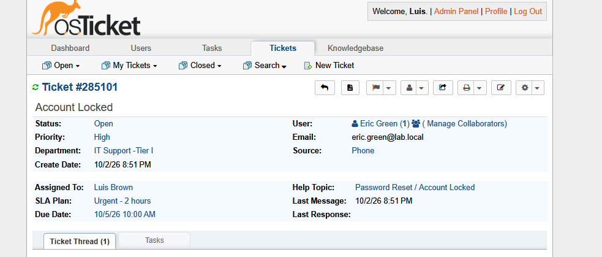
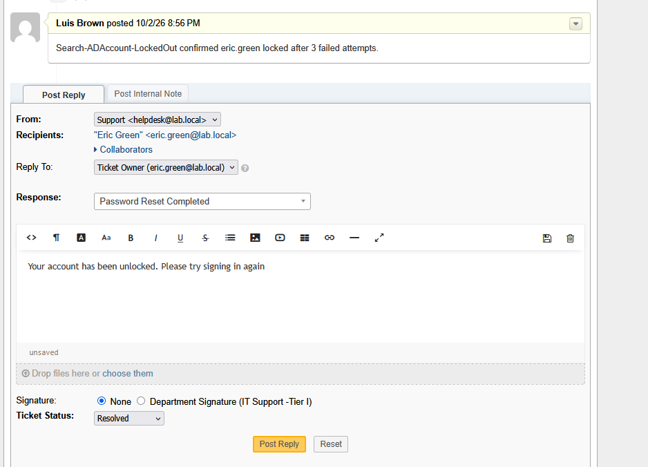

# OT-2 — Account Locked, Reported by Phone (Ticket #285101)

**Channel:** Phone (agent-created) · **Help Topic:** Password Reset / Account Locked · **Routed to:** Tier I · **Priority:** High

**Workflow**
1. Eric Green could not sign in, so the agent opened the ticket on his behalf with **Source: Phone**.
2. Internal note: `Search-ADAccount -LockedOut` confirmed the account was locked after 3 failed attempts.
3. Unlocked with `Unlock-ADAccount eric.green`.
4. Replied to the user and set the status to **Resolved**.

