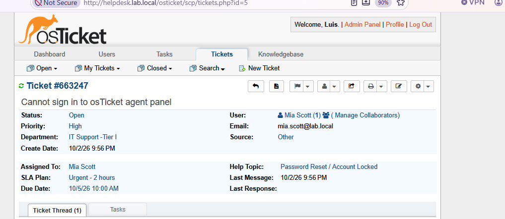
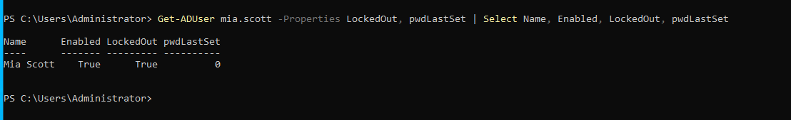
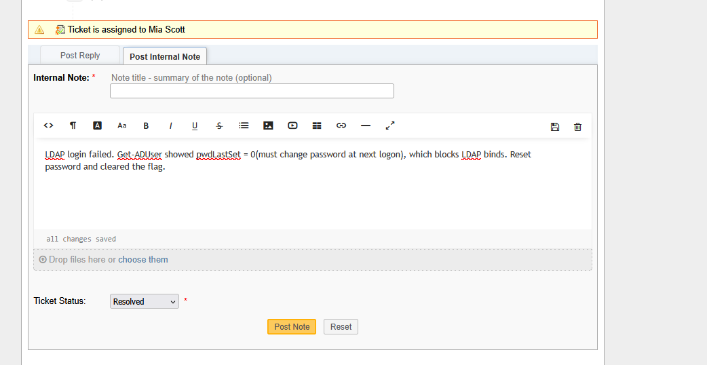

# OT-3 — Agent Cannot Sign In to osTicket (Ticket #663247)

**Channel:** Other (internal) · **Assigned to:** Mia Scott · **Priority:** High

**Troubleshooting**
- LDAP sign-in to the staff panel returned *Access denied*.
- `Get-ADUser mia.scott -Properties LockedOut, pwdLastSet` showed **LockedOut = True** and **pwdLastSet = 0**.

**Root cause**
- `pwdLastSet = 0` (must change password at next logon) prevents LDAP binds.
- Repeated failed attempts then triggered the AD lockout policy.

**Resolution**
- `Unlock-ADAccount`, reset the password, and `Set-ADUser -ChangePasswordAtLogon $false`.
- Agent signed in successfully; ticket set to **Resolved**.

