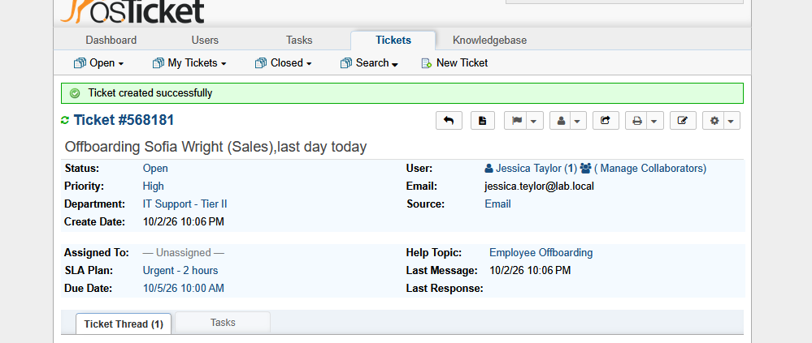
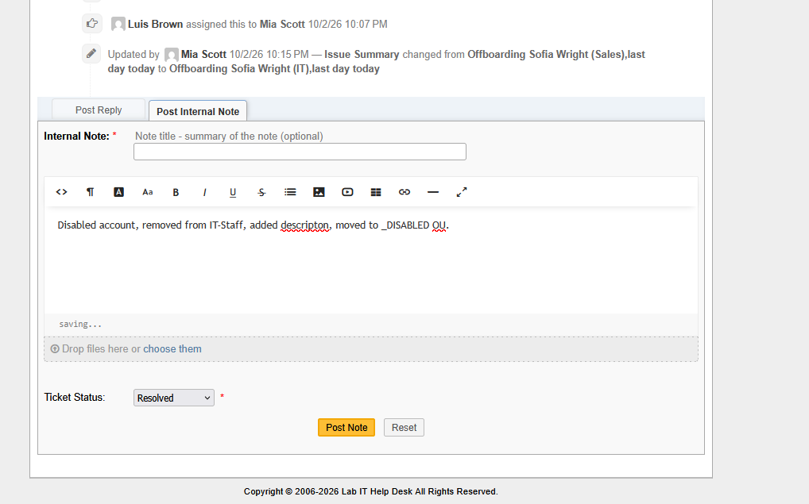
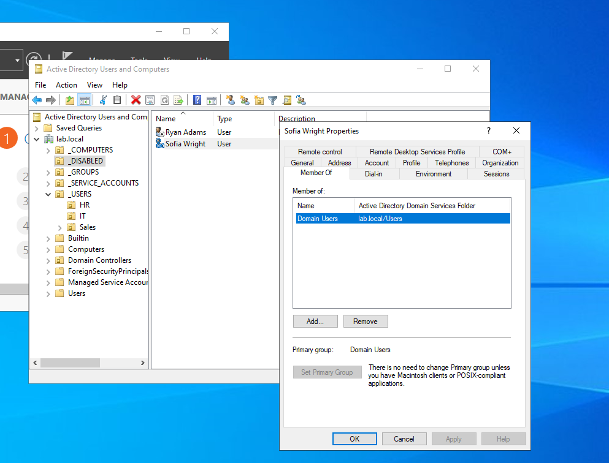

# OT-4 — Employee Offboarding, Auto-Routed to Tier II (Ticket #568181)

**Channel:** Email (agent-created for HR) · **Help Topic:** Employee Offboarding · **Routed to:** **Tier II** automatically · **Priority:** High

**Workflow**
1. HR (Jessica Taylor) requested offboarding for Sofia Wright.
2. The Help Topic routed the ticket straight to Tier II; it was assigned to Mia Scott.
3. Mia corrected the department in the subject (Sofia is in **IT**, not Sales) after checking AD.
4. Offboarding in AD: disabled the account, removed it from `IT-Staff`, added a description with the ticket number, and moved it to `_DISABLED`.
5. Internal note with the actions taken; status set to **Resolved**.

