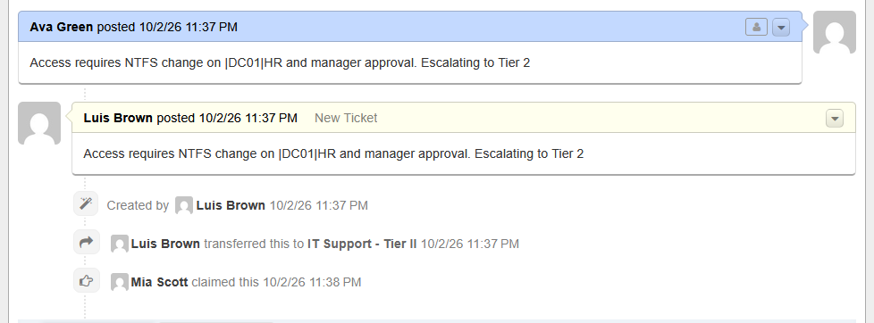

# OT-5 — Shared Folder Access, Escalated to Tier II

**Channel:** Agent-created on behalf of the user · **Help Topic:** Shared Drive / File Access · **Started in:** Tier I · **Escalated to:** Tier II

**Workflow**
1. Ava Green asked for access to the HR shared folder; the Tier I agent (Luis Brown) opened the ticket for her.
2. Tier I assessment: access requires an NTFS change on `\\DC01\HR` and approval from the HR manager, so the ticket needs Tier II.
3. Ticket **transferred** to IT Support - Tier II; Mia Scott **claimed** it one minute later.

**Why escalate:** granting access to another department's share changes permissions and needs manager approval (least privilege), which is outside Tier I scope.

**Lesson learned:** the Tier I assessment was typed into the ticket message, so it appears as if the user wrote it. Assessments belong in an **internal note** so the user does not see them.

